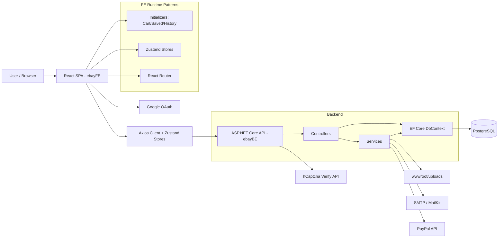
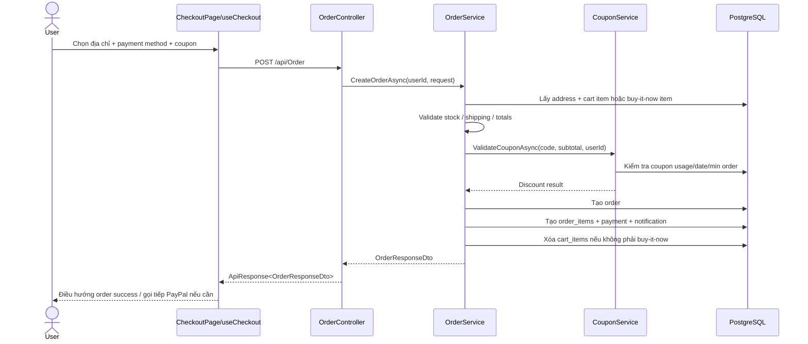

# Tổng quan dự án

## Mục đích hệ thống

Đây là một hệ thống `eBay clone` theo mô hình marketplace, phục vụ cả buyer và seller. Hệ thống cho phép:

- Buyer tìm kiếm, xem chi tiết, lưu, theo dõi, mua và đặt hàng sản phẩm.
- Seller tạo cửa hàng, đăng bán sản phẩm, tạo coupon và theo dõi một phần dữ liệu kinh doanh.
- Hệ thống duy trì thêm hành vi người dùng như `saved items`, `watchlist`, `view history`, `recommendations`.

## Bài toán nghiệp vụ đang giải quyết

- Chuẩn hóa hành trình mua hàng từ khám phá sản phẩm đến đặt hàng.
- Cung cấp năng lực bán hàng cơ bản cho seller: listing, store, coupon.
- Tăng giữ chân người dùng qua saved/watchlist/history/recommendation.
- Tạo nền cho trải nghiệm marketplace lớn hơn với schema đã chuẩn bị cho review, message, dispute, returns, analytics.

## Đối tượng người dùng

- `Guest`: duyệt sản phẩm, xem lịch sử gần đây qua cookie, thao tác bảo mật trước khi vào một số action.
- `Buyer`: đăng ký, đăng nhập, quản lý địa chỉ, cart, orders, saved, watchlist, history.
- `Seller`: quản lý store, listings, coupon và xem một phần thông tin seller profile.
- `Admin`: role có trong backend/schema nhưng chưa có admin module chuyên dụng.

## Phạm vi runtime thực tế

- Runtime chính của hệ thống hiện nằm ở `ebayFE` và `ebayBE`.
- Hai thư mục `guild_ui` và `seller_ui` là tài nguyên/prototype UI, không phải ứng dụng runtime chính.

# Công nghệ sử dụng

## Frontend

| Công nghệ | Vai trò |
| --- | --- |
| `React 19` | UI framework cho SPA |
| `Vite 7` | Dev server và build tool |
| `React Router DOM 7` | Routing cho client |
| `Zustand` | State management cho auth, product, category, order, history, saved, watchlist |
| `Axios` | HTTP client |
| `React Hook Form + Yup` | Form state và validation |
| `Tailwind CSS 4` | Styling |
| `@react-oauth/google` | Google login ở FE |
| `@hcaptcha/react-hcaptcha` | UI cho hCaptcha challenge |
| `@paypal/react-paypal-js` | PayPal-related UI integration |
| `date-fns`, `lucide-react`, `react-hot-toast` | Utilities, icons, toast |

## Backend

| Công nghệ | Vai trò |
| --- | --- |
| `ASP.NET Core Web API (.NET 9)` | Backend monolith/API host |
| `Entity Framework Core 9` | ORM |
| `Npgsql` | PostgreSQL provider |
| `JWT Bearer` | Authentication |
| `FluentValidation` | Validation layer |
| `BCrypt.Net` | Password hashing |
| `MailKit / MimeKit` | Email sending |
| `Google.Apis.Auth` | Dự kiến verify social token ở server |
| `Swashbuckle` | Swagger/OpenAPI |
| `DotNetEnv` | Load biến môi trường từ `.env` |

## Database / Infra / External

| Thành phần | Vai trò |
| --- | --- |
| `PostgreSQL` | Primary relational database |
| `Docker Compose` | Chạy DB + API ở local/container |
| `SMTP Gmail` | Gửi OTP / reset mail |
| `Google OAuth` | Social login flow |
| `hCaptcha` | Verification step trước một số action yêu cầu đăng nhập |
| `PayPal REST API` | Thanh toán PayPal |
| `wwwroot/uploads` | Static file storage cho ảnh upload |

# Kiến trúc hệ thống

## Mô hình kiến trúc

- `Monolith full-stack`
- Frontend tách riêng thành SPA
- Backend dùng `Layered Architecture` theo dạng `Controller -> Service -> DbContext`
- Không phải Clean Architecture hoàn chỉnh vì:
  - service truy cập `EbayDbContext` trực tiếp
  - không có repository abstraction
  - một số controller mới (`Saved`, `Watchlist`, `History`, `Analytics`) truy cập DbContext trực tiếp, bỏ qua service layer

## Sơ đồ kiến trúc tổng thể



## Cách các thành phần tương tác

1. `main.jsx` khởi tạo `GoogleOAuthProvider` và mount `App`.
2. `App.jsx` tạo router, lazy-load page và trigger `checkAuth`.
3. `MainLayout` mount các initializer để đồng bộ `cart`, `saved`, `watchlist`, `history`.
4. Frontend gọi API qua `lib/axios.js`, access token lấy từ cookie, refresh token giữ trong Zustand.
5. Backend xác thực JWT từ cookie `accessToken`, sau đó route về controller.
6. Controller gọi service hoặc truy cập trực tiếp `EbayDbContext` tùy module.
7. EF Core thao tác với PostgreSQL.
8. Một số service gọi external services như SMTP và PayPal.

## Luồng dữ liệu và xử lý

- Luồng chuẩn:
  - `UI event -> Zustand / hook -> Axios -> Controller -> Service -> DbContext -> PostgreSQL -> DTO -> FE render`
- Luồng session:
  - login trả `refreshToken` trong body, `accessToken` vào cookie HttpOnly
  - 401 trên FE sẽ kích hoạt refresh
- Luồng hành vi người dùng:
  - product detail gọi `trackView`
  - history sync khi guest login
  - saved/watchlist fetch khi auth state đổi

## Dependency ở mức high-level

- `ProductService` phụ thuộc `FileService` và `CategoryService`
- `OrderService` phụ thuộc `CouponService`
- `AuthService` phụ thuộc `JwtService`, `PasswordHasher`, `EmailService`
- `MainLayout` phụ thuộc `CartInitializer`, `SavedInitializer`, `HistoryInitializer`
- `ProductDetailsPage` phụ thuộc `useProductStore`, `useHistoryStore`, `useRecommendations`, `useWatchlistStore`, `useCart`
- `Header` phụ thuộc `useCategoryStore`, `useRequireAuth`, `useAuthStore`, `useCartStore`

# Cấu trúc thư mục

## Root

```text
Ebay-Clone/
├── ebayBE/
├── ebayFE/
├── guild_ui/      # design artifacts / HTML mock
├── seller_ui/     # design screenshots
├── CODING_RULES_BE.md
└── CODING_RULES_FE.md
```

## Frontend

```text
ebayFE/src
├── components/    # layouts, shared UI, product-specific composite components
├── features/      # domain-specific stores/hooks/components
├── pages/         # route pages
├── store/         # global Zustand stores
├── lib/           # axios client, shared helpers
├── App.jsx        # router entry
└── main.jsx       # application bootstrap
```

### Vai trò từng thư mục chính

- `components/layouts`: `MainLayout`, `AuthLayout`, `SellerLayout`
- `components/product`: detail page composition, seller modal, gallery, coupon, recommended items
- `features/cart|history|saved|watchlist|checkout|seller|auth|products`: domain-specific logic
- `pages`: route-level screens như `HomePage`, `ProductsPage`, `SavedPage`, `WatchlistPage`, seller pages, auth pages
- `store`: global store như `useAuthStore`, `useProductStore`, `useCategoryStore`
- `lib/axios.js`: HTTP client trung tâm

### Entry point frontend

- `ebayFE/src/main.jsx`
- `ebayFE/src/App.jsx`

## Backend

```text
ebayBE/
├── Controllers/
├── Services/
│   ├── Interfaces/
│   └── Implementations/
├── Models/
├── DTOs/
│   ├── Requests/
│   └── Responses/
├── Middlewares/
├── Validators/
├── Configuration/
├── Docker/DB/Init/
├── Program.cs
├── appsettings.json
└── docker-compose.yml
```

### Vai trò từng thư mục chính

- `Controllers`: public API surface
- `Services/Implementations`: business logic chính
- `Models`: entity + `EbayDbContext`
- `DTOs`: request/response contracts
- `Middlewares`: exception, anti-spam, rate limit
- `Validators`: FluentValidation
- `Docker/DB/Init`: SQL init + sample data

### Entry point backend

- `ebayBE/Program.cs`

## Ghi chú về structure

- FE đang ở trạng thái `hybrid architecture`: vừa feature-based vừa file-based.
- BE chủ yếu theo layered style, nhưng có controller trực tiếp query DbContext làm kiến trúc chưa đồng nhất.

# Phân tích module

## 1. Auth & Identity

| Thành phần | Nội dung |
| --- | --- |
| Vai trò | Đăng ký, đăng nhập, social login, refresh token, logout, profile, đổi mật khẩu, upgrade seller, captcha verify |
| File/class quan trọng | `AuthController`, `AuthService`, `JwtService`, `PasswordHasher`, `EmailService`, `useAuthStore`, `LoginForm`, `RegisterPage`, `SecurityMeasurePage` |
| Hàm chính | `RegisterAsync`, `LoginAsync`, `SocialLoginAsync`, `VerifyOtpAsync`, `ForgotPasswordAsync`, `ChangePasswordAsync`, `UpgradeToSellerAsync` |
| Nghiệp vụ | Quản lý user lifecycle, OTP email verification, password reset, role upgrade, token rotation |

## 2. Category & Navigation

| Thành phần | Nội dung |
| --- | --- |
| Vai trò | Trả category tree và navigation groups cho header/search |
| File/class quan trọng | `CategoryController`, `CategoryService`, `NavCategoryConfig`, `useCategoryStore`, `Header.jsx` |
| Hàm chính | `GetCategoriesAsync`, `GetCategoryTreeAsync`, `GetNavGroupsAsync`, `GetNavGroupBySlugAsync` |
| Nghiệp vụ | Build tree category từ bảng `categories`, flatten và group theo nav config, cache bằng MemoryCache |

## 3. Product Catalog, Search & Recommendation

| Thành phần | Nội dung |
| --- | --- |
| Vai trò | Landing page, search, detail, related products, recommendations, seller listing CRUD |
| File/class quan trọng | `ProductController`, `ProductService`, `FileService`, `useProductStore`, `ProductsPage`, `ProductDetailsPage`, `SellerListingsPage` |
| Hàm chính | `GetLandingPageProductsAsync`, `SearchProductsAsync`, `GetProductByIdAsync`, `GetRecommendationsAsync`, `CreateProductAsync`, `UpdateProductAsync` |
| Nghiệp vụ | Lọc/sắp xếp product, tăng view count, lấy coupon active, tính popularity metrics như sold/saved/in-cart, upload ảnh |

## 4. Cart

| Thành phần | Nội dung |
| --- | --- |
| Vai trò | Guest cart local + server cart cho user đăng nhập |
| File/class quan trọng | `CartController`, `CartService`, `useCartStore`, `useCart`, `CartInitializer`, `CartPage` |
| Hàm chính | `GetCartAsync`, `AddToCartAsync`, `UpdateQuantityAsync`, `MergeCartAsync`, `ClearCartAsync` |
| Nghiệp vụ | Merge giỏ guest vào account, giữ cart state cục bộ và đồng bộ server khi login |

## 5. Checkout, Order & Payment

| Thành phần | Nội dung |
| --- | --- |
| Vai trò | Tạo đơn hàng từ cart hoặc Buy It Now, tạo payment record, hủy order, PayPal create/capture |
| File/class quan trọng | `OrderController`, `OrderService`, `PaypalController`, `PaypalService`, `useCheckout`, `CheckoutPage` |
| Hàm chính | `CreateOrderAsync`, `CancelOrderAsync`, `CreateOrder`, `CaptureOrder` |
| Nghiệp vụ | Validate address, stock, coupon, deduct stock, create `orders/order_items/payments`, clear cart |

## 6. Coupon / Promotion

| Thành phần | Nội dung |
| --- | --- |
| Vai trò | Validate coupon và CRUD coupon cho seller |
| File/class quan trọng | `CouponController`, `CouponService`, `CreateCouponForm`, `SellerMarketingPage` |
| Hàm chính | `ValidateCouponAsync`, `UseCouponAsync`, `CreateCouponAsync`, `UpdateCouponAsync` |
| Nghiệp vụ | Validate usage/date/min order/discount type, áp coupon theo store/category/product |

## 7. Store & Seller Profile

| Thành phần | Nội dung |
| --- | --- |
| Vai trò | Tạo/cập nhật/deactivate store, lấy public seller profile và seller reviews |
| File/class quan trọng | `StoreController`, `StoreService`, `SellerController`, `SellerService`, `SellerStorePage`, `SellerSection` |
| Hàm chính | `CreateStoreAsync`, `UpdateStoreAsync`, `GetSellerProfileAsync`, `GetSellerReviewsAsync` |
| Nghiệp vụ | Slug hóa store, upload logo/banner, tổng hợp positive rating, items sold, detailed ratings |

## 8. Auction / Bid

| Thành phần | Nội dung |
| --- | --- |
| Vai trò | Đặt giá bid, xem lịch sử bid, bid thắng hiện tại |
| File/class quan trọng | `BidController`, `BidService`, `useAuctionStore`, `ProductPurchaseOptions` |
| Hàm chính | `PlaceBidAsync`, `GetBidsByProductIdAsync`, `GetWinningBidAsync` |
| Nghiệp vụ | Kiểm tra bid cho auction item và lưu trạng thái đấu giá |

## 9. Saved & Watchlist

| Thành phần | Nội dung |
| --- | --- |
| Vai trò | Lưu sản phẩm quan tâm và theo dõi sản phẩm |
| File/class quan trọng | `SavedController`, `WatchlistController`, `useSavedStore`, `useWatchlistStore`, `SavedPage`, `WatchlistPage` |
| Hàm chính | `GetSaved`, `Toggle`, `GetWatchlist`, `toggleSaved`, `toggleWatch` |
| Nghiệp vụ | Toggle save/watch, fetch danh sách đầy đủ cho user, hiển thị counter trạng thái trên product card/detail |

## 10. History & Analytics

| Thành phần | Nội dung |
| --- | --- |
| Vai trò | Ghi lại sản phẩm đã xem, sync guest history sang user, thống kê most-viewed và conversion-rate |
| File/class quan trọng | `HistoryController`, `AnalyticsController`, `HistoryCleanupService`, `useHistoryStore`, `useRecommendations` |
| Hàm chính | `TrackView`, `GetHistory`, `SyncGuestHistory`, `MostViewed`, `ConversionRate`, `GetRecommendationsAsync` |
| Nghiệp vụ | Dùng cookie guest + TTL, merge history khi login, xóa lịch sử hết hạn hàng ngày, recommendation theo category + price band |

## 11. Address & Profile

| Thành phần | Nội dung |
| --- | --- |
| Vai trò | CRUD địa chỉ và cập nhật profile |
| File/class quan trọng | `AddressController`, `AddressService`, `ProfilePage`, `AddressTab`, `SecurityTab` |
| Hàm chính | `GetUserAddressesAsync`, `CreateAddressAsync`, `SetDefaultAddressAsync`, `UpdateProfileAsync` |
| Nghiệp vụ | Gán default address, ràng buộc address ownership với user |

## 12. Passive / Schema-Only Modules

| Module | Trạng thái |
| --- | --- |
| `Review`, `SellerFeedback` | Có model/table, seller profile đang tận dụng read side |
| `Notification` | Có create trong order flow, chưa có FE module đọc |
| `Inventory` | Có table/model, nhưng stock thực tế chủ yếu dùng `products.stock` |
| `Message`, `ReturnRequest`, `Dispute`, `AuditLog` | Có trong schema nhưng chưa có API/UI runtime đầy đủ |
| `VwProductListing`, `VwOrderSummary` | Có DB view/model, chưa thấy dùng mạnh ở runtime hiện tại |

# Tính năng

## Tính năng buyer/guest

- Đăng ký / đăng nhập / social login / refresh session
- Xác thực OTP email và reset password
- hCaptcha verification trước một số secure action
- Duyệt category và nav group từ header
- Search/filter/sort sản phẩm
- Xem product detail, related items, recommendations
- Add to cart, Buy It Now
- Saved items
- Watchlist
- Recently viewed history
- Checkout, order history, cancel order

## Tính năng seller

- Upgrade account thành seller
- Tạo store / cập nhật store / deactivate store
- CRUD listing sản phẩm
- Bulk delete / bulk status listing
- Tạo / sửa / kết thúc coupon
- Xem seller profile / seller reviews

## Tính năng hệ thống phụ trợ

- Daily cleanup cho product view history hết hạn
- Analytics API: most viewed products, conversion rate
- Swagger cho API exploration
- Dockerized DB + API

## Business logic highlight

> `CategoryService` build category tree từ bảng `categories`, cache 1 giờ và tạo thêm `nav groups` để header render mega-menu.

> `ProductService.GetRecommendationsAsync` chọn sản phẩm cùng category, cùng biên độ giá `50% - 150%`, loại trừ product hiện tại và lịch sử đã xem; nếu chưa đủ sẽ fallback sang sản phẩm cùng biên giá nhưng ngoài category.

> `ProductService.MapToDto` tính thêm các chỉ số hành vi: `SoldCount = sum(order_items.quantity)`, `SavedCount = wishlists + watchlist`, `InCartCount = cart_items.count`.

> `HistoryController` hỗ trợ song song guest và logged-in user bằng `cookieId` + `userId`; guest history có TTL 30 ngày, user history 90 ngày; login sẽ sync guest history vào account và cleanup duplicate.

> `SellerService` dựng seller profile từ nhiều nguồn: `seller_feedback`, `reviews`, `order_items`, rồi suy ra positive rate và detailed ratings.

> `OrderService` gom cả hai flow `cart checkout` và `buy-it-now` vào cùng pipeline, tạo order/payment/notification trong transaction.

# Luồng dữ liệu

## Luồng dữ liệu chính

```text
UI action
-> FE hook/store
-> Axios request
-> Controller
-> Service / DbContext
-> PostgreSQL
-> DTO response
-> Zustand/UI render
```

## Luồng đặc trưng theo chức năng

### Product detail -> history -> recommendation

```text
ProductDetailsPage load
-> fetch product + related products
-> useHistoryStore.trackView(product)
-> POST /api/History/{productId}
-> ProductViewHistories upsert theo userId hoặc cookieId
-> useRecommendations(productId, excludeIds)
-> GET /api/Product/{id}/recommendations
-> ProductService chọn sản phẩm cùng category/price band
```

### Login -> data bootstrap

```text
Login success
-> useAuthStore.set(user, refreshToken)
-> MainLayout initializers re-run
-> CartInitializer fetch cart
-> SavedInitializer fetch saved + watchlist
-> HistoryInitializer sync guest history -> fetch history
```

### Checkout



## Data model chính

- `users` là trung tâm cho auth, address, orders, refresh tokens, saved/watch/history.
- `products` là trung tâm cho listing, cart, order_items, bids, reviews, wishlists, watchlist, history.
- `orders` nối buyer, address, coupon, payment, order_items.
- `stores` và `users(role=seller)` là trục seller.
- `product_view_history` nối behavior tracking với analytics và recommendation context.

## Dependency data flow đáng chú ý

- `OrderService` phụ thuộc `CouponService`, nên coupon logic ảnh hưởng trực tiếp checkout.
- `ProductService` phụ thuộc `CategoryService` cho multi-category/nav-group search.
- `Saved` và `Watchlist` đang dùng chung kiểu response DTO để render hai page khác nhau.
- `Header`, `ProductsPage` và `CategoryService` tạo thành một dependency chain cho search navigation.

# API

## Nguyên tắc response

- Phần lớn API trả về `ApiResponse<T>`
- Authentication đọc access token từ cookie
- Refresh token gửi qua body
- Một số controller chưa đồng nhất hoàn toàn, đặc biệt `BidController`

## Danh sách endpoint chính

### AuthController

- `POST /api/Auth/register`
- `POST /api/Auth/login`
- `POST /api/Auth/social-login`
- `POST /api/Auth/refresh-token`
- `POST /api/Auth/revoke-token`
- `POST /api/Auth/logout`
- `POST /api/Auth/verify-otp`
- `POST /api/Auth/resend-otp`
- `GET /api/Auth/verify-email`
- `POST /api/Auth/send-verification-email`
- `POST /api/Auth/forgot-password`
- `POST /api/Auth/verify-reset-otp`
- `POST /api/Auth/reset-password`
- `POST /api/Auth/change-password`
- `GET /api/Auth/me`
- `POST /api/Auth/verify-captcha`
- `PUT /api/Auth/profile`
- `POST /api/Auth/upgrade-seller`
- `GET /api/Auth/health`

### AddressController

- `GET /api/Address`
- `GET /api/Address/{id}`
- `POST /api/Address`
- `PUT /api/Address/{id}`
- `DELETE /api/Address/{id}`
- `PATCH /api/Address/{id}/default`

### CategoryController

- `GET /api/Category`
- `GET /api/Category/nav`
- `GET /api/Category/nav/{slug}`

### ProductController

- `GET /api/Product/landing`
- `GET /api/Product`
- `GET /api/Product/{id}`
- `GET /api/Product/slug/{slug}`
- `GET /api/Product/{id}/related`
- `GET /api/Product/{id}/recommendations`
- `GET /api/Product/seller/me`
- `POST /api/Product`
- `PUT /api/Product/{id}`
- `PATCH /api/Product/{id}/toggle-visibility`
- `DELETE /api/Product/{id}`
- `POST /api/Product/bulk-delete`
- `PATCH /api/Product/bulk-status`

### CartController

- `GET /api/Cart`
- `POST /api/Cart/items`
- `PUT /api/Cart/items/{productId}`
- `DELETE /api/Cart/items/{productId}`
- `POST /api/Cart/merge`
- `DELETE /api/Cart`

### OrderController

- `POST /api/Order`
- `GET /api/Order`
- `GET /api/Order/{id}`
- `PUT /api/Order/{id}/cancel`

### PaypalController

- `POST /api/Paypal/create-order/{orderId}`
- `POST /api/Paypal/capture-order/{paypalOrderId}`

### CouponController

- `POST /api/Coupon/validate`
- `GET /api/Coupon`
- `GET /api/Coupon/seller`
- `GET /api/Coupon/{id}`
- `POST /api/Coupon`
- `PUT /api/Coupon/{id}`
- `DELETE /api/Coupon/{id}`
- `GET /api/Coupon/{id}/products`
- `PATCH /api/Coupon/{id}/end`

### StoreController

- `GET /api/Store/me`
- `GET /api/Store/user/{userId}`
- `POST /api/Store`
- `PUT /api/Store/me`
- `DELETE /api/Store/me`

### SellerController

- `GET /api/Seller/{id}`
- `GET /api/Seller/{id}/reviews`

### BidController

- `POST /api/Bid/{productId}`
- `GET /api/Bid/{productId}`
- `GET /api/Bid/{productId}/winning`

### SavedController / WatchlistController / HistoryController / AnalyticsController

- `GET /api/Saved`
- `POST /api/Saved/{productId}`
- `GET /api/Watchlist`
- `POST /api/Watchlist/{productId}`
- `POST /api/History/{productId}`
- `GET /api/History`
- `POST /api/History/sync`
- `GET /api/Analytics/most-viewed`
- `GET /api/Analytics/conversion-rate`

## Request/Response đáng chú ý

- `CreateOrderRequestDto`
  - `addressId`, `paymentMethod`, `couponCode`, `selectedCartItemIds`
  - thêm `buyItNowProductId`, `buyItNowQuantity`
- `ProductSearchRequestDto`
  - hỗ trợ `keyword`, `categoryId`, `categorySlugs`, `minPrice`, `maxPrice`, `sortBy`
- `ProductResponseDto`
  - ngoài thông tin listing còn có `savedCount`, `inCartCount`, `soldCount`, `activeCoupons`
- `HistoryItemResponseDto`
  - lưu tên, ảnh, giá, seller, `viewedAt`

# Đánh giá code

## Coding style có đồng nhất không

### Điểm tốt

- Backend đặt tên class/interface/DTO khá đồng nhất.
- FE dùng naming tương đối ổn định cho store/hook (`useXxxStore`, `useXxx`).
- DTO request/response tách rõ.
- Có middleware exception và rate limit.

### Điểm chưa đồng nhất

- Không phải mọi controller đều đi qua service layer.
- Không phải mọi endpoint đều trả cùng chuẩn response.
- FE vừa dùng service layer vừa gọi `api` trực tiếp.
- FE có cả `VITE_API_BASE_URL` lẫn code đang đọc `VITE_API_URL`.

## Bug tiềm ẩn / rủi ro lớn

### 1. Social login chưa verify token ở backend

- `AuthService.SocialLoginAsync` vẫn trust dữ liệu/token từ frontend.
- Đây là lỗ hổng auth nghiêm trọng nếu coi hệ thống là production.

### 2. Coupon authorization flaw vẫn tồn tại

- `POST /api/Coupon` và `PATCH /api/Coupon/{id}/end` không ép role seller/admin.
- `CreateCouponAsync` không bind seller hiện tại vào `StoreId`.

### 3. hCaptcha flow chưa đủ cấu hình để chạy thật

- FE có `SecurityMeasurePage` với sitekey hard-coded.
- Backend `verify-captcha` cần `HCaptchaSecret:Secret`, nhưng config hiện tại không thấy khai báo trong `appsettings` hay `.env`.
- Trong trạng thái hiện tại, flow captcha có thể fail 500 ở runtime.

### 4. Env var frontend bị lệch tên

- `.env` frontend đang dùng `VITE_API_BASE_URL`
- `lib/axios.js` và `features/auth/services/authService.js` lại đọc `VITE_API_URL`
- Kết quả: FE có thể fallback về `http://localhost:5000` thay vì dùng biến môi trường mong muốn.

### 5. Guest checkout chưa hoàn chỉnh

- FE có `GuestCheckoutModal` và state `guestShipping`
- Nhưng backend `OrderController` yêu cầu `[Authorize]`
- `useCheckout.handlePlaceOrder()` vẫn đòi `selectedAddressId`
- Kết luận: guest checkout UI có mặt, nhưng flow production chưa thực sự hoàn thiện

### 6. Auction filter ở FE không khớp backend

- `ProductsPage` set `Condition=auctions`
- Backend `Condition` dùng cho trạng thái sản phẩm (`new/used/refurbished`)
- Chưa thấy backend filter đúng theo `IsAuction`

### 7. `upgradeToSeller` vẫn được gọi ở FE nhưng không có action tương ứng trong auth store

- `SellerStorePage` destructure `upgradeToSeller` từ `useAuthStore`
- `useAuthStore` hiện không expose function này

### 8. Order/Coupon flow có lỗi business nghiêm trọng

- `OrderService.CreateOrderAsync` gọi `UseCouponAsync` trước khi coupon usage gắn với order cụ thể
- `CouponService.UseCouponAsync` tạo `CouponUsage` không set `OrderId`
- Nếu DB bắt buộc `order_id`, flow có thể lỗi hoặc tạo data inconsistency

### 9. Notification type có thể không khớp DB constraint

- `OrderService` đang ghi `Notification.Type = "order_success"`
- Schema trước đây của hệ thống dùng tập type hạn chế hơn
- Đây là điểm cần xác nhận migration hiện tại, nhưng là risk data integrity rõ ràng

### 10. Stored XSS tiềm ẩn

- Mô tả product từ seller đi qua backend dưới dạng raw text/HTML
- FE `AboutThisItem.jsx` dùng `dangerouslySetInnerHTML`
- Chưa thấy sanitize pipeline rõ ràng

### 11. Cookie history cho guest để `HttpOnly = false` không thực sự cần thiết

- Comment backend nói FE cần đọc cookie để sync
- Nhưng flow hiện tại sync guest history bằng request cookie server-side, FE không phải tự đọc giá trị
- Đây là bề mặt tấn công thừa

### 12. Secrets đang commit trong `.env`

- DB credential, mail password, Google client id, JWT secret đều có trong repo
- Với giả định production, đây là issue rất nghiêm trọng

## Anti-pattern / debt

- Backend service layer không nhất quán vì nhiều controller mới dùng thẳng DbContext.
- FE state/data-fetching bị phân mảnh giữa global store, feature store, direct axios call.
- Hai thư mục `guild_ui` và `seller_ui` có thể gây nhầm lẫn scope runtime.
- `Inventory` tồn tại nhưng business stock lại chủ yếu ở `products.stock`.
- Có hosted service cleanup cho history, nhưng các domain support khác chưa có lifecycle rõ.

## Build / test status

- `dotnet build` ở backend: thành công, có `27 warnings`
- `npm run build` ở frontend: fail vì Rollup không resolve được `@react-oauth/google`
- Không tìm thấy test suite đáng kể trong repo hiện tại

# Đề xuất cải thiện

## Ưu tiên P0

1. Verify social token ở backend bằng Google official verification.
2. Siết role và ownership cho coupon create/update/delete/end.
3. Gỡ secrets khỏi repo và chuyển sang secret manager / env injection an toàn.
4. Hoàn thiện cấu hình hCaptcha: secret server-side, không hard-code sitekey nhạy cảm trong page.
5. Sửa mismatch env frontend: chuẩn hóa một biến duy nhất cho API base URL.
6. Sửa guest checkout:
   - hoặc bỏ hẳn UI guest checkout
   - hoặc implement guest order flow đúng nghĩa
7. Sửa `upgradeToSeller` end-to-end.
8. Chặn stored XSS bằng sanitize hoặc render plain text.

## Ưu tiên P1

1. Thống nhất architecture backend:
   - mọi controller đi qua service layer
   - không query DbContext trực tiếp trong controller
2. Tách rõ domain modules ở FE:
   - auth
   - browse/search
   - cart/checkout
   - saved/watchlist/history
   - seller
3. Chuẩn hóa response contract và sinh typed API client nếu có thể.
4. Sửa order/coupon transaction để coupon usage gắn chặt với order.
5. Sửa filter auction/search contract.
6. Tách cấu hình ra environment-specific file và validate startup config đầy đủ.

## Ưu tiên P2

1. Bổ sung test:
   - backend integration test cho auth/order/coupon/history
   - frontend smoke test cho login/search/product detail/checkout
2. Quyết định số phận của `Inventory`:
   - dùng thật
   - hoặc loại khỏi design hiện tại
3. Tạo admin module nếu business thực sự cần moderation/analytics/banner management.
4. Hoàn thiện các module schema-only như notification center, messaging, returns, disputes.
5. Tăng observability:
   - structured logs
   - metrics cho history/recommendation
   - health checks sâu hơn

## Kết luận

Codebase hiện tại đã vượt khỏi một e-commerce CRUD đơn giản và bắt đầu có các lớp hành vi người dùng như `saved`, `watchlist`, `history`, `recommendation`, `analytics`. Điểm mạnh của hệ thống là domain breadth khá tốt và backend đã có nhiều capability hơn mức UI thể hiện. Tuy nhiên, nếu coi đây là production system, hệ thống vẫn còn nhiều gap quan trọng ở auth security, config management, consistency kiến trúc và completeness của checkout/seller flows.

Về mặt kiến trúc, đây là một `modular monolith` chưa hoàn tất chuẩn hóa. Nền tảng hiện tại đủ tốt để tiếp tục phát triển, nhưng trước khi scale hoặc public release, cần ưu tiên xử lý các vấn đề P0/P1 ở trên.
