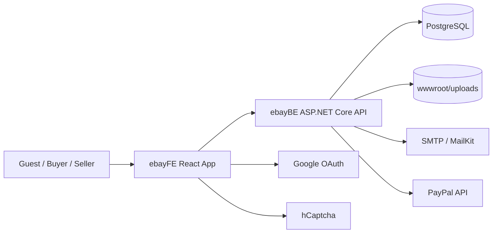
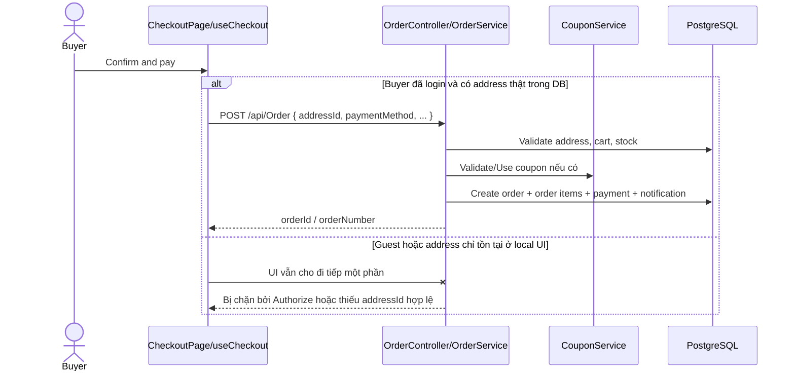

# Internal System Audit - Ebay Clone

Ngày audit: 2026-03-25

## Phạm vi và giả định
- Phạm vi đã đọc: `ebayFE`, `ebayBE`, `ebayBE/Docker`, SQL seed/init, config `.env` và `appsettings`, các page/component/store/service chính, DB model, controller, service, migration, docker compose.
- Phần được xem là runtime chính: `ebayFE` và `ebayBE`.
- `guild_ui` và `seller_ui` chỉ là asset/prototype UI, không thấy được wire vào runtime chính.
- Dự án được đánh giá như một hệ thống chuẩn bị lên production, không đánh giá theo tiêu chí đồ án demo.
- Nếu một kết luận phụ thuộc môi trường deploy thật mà repo không cung cấp, tài liệu sẽ ghi rõ: `chưa đủ dữ liệu để xác nhận`.

## 0. Kết luận điều hành
- Đây là một marketplace kiểu eBay clone, cho phép buyer duyệt sản phẩm, thêm vào giỏ, đặt hàng; seller tạo store, đăng listing, tạo coupon; hệ thống có thêm auction, watchlist, saved, history, analytics.
- Về business intent, domain là `ecommerce / marketplace / C2C-B2C hybrid`.
- Về mức độ hoàn thiện tổng thể, hệ thống ở khoảng `40% - 45%` so với mức cần có để vận hành production tối thiểu.
- Những gì đang có thật và có thể demo khá ổn: browse/search/category, product detail mức cơ bản, cart local + server, seller listing CRUD cơ bản, coupon dashboard mức seller, login/register/password reset.
- Những gì đang là blocker lớn: checkout/address binding, guest checkout, coupon integrity, social login verification, payment hardening, notification/order schema mismatch, security hardening, production build frontend, thiếu test và thiếu vận hành.
- Kết luận kiến trúc ngắn: đây là `modular monolith` nhưng mới ở mức `layered một phần`; có nhiều điểm `layered giả` vì một số controller đi thẳng `DbContext`, contract FE/BE drift khá mạnh, nhiều module mới dừng ở `UI shell`, `API shell`, hoặc `schema only`.

## 0.1. Snapshot kiểm chứng kỹ thuật
- `dotnet build` tại `ebayBE` chạy thành công, `0 warnings`, `0 errors`.
- `npm run build` tại `ebayFE` đang fail vì Vite không resolve được `@react-oauth/google` từ `src/main.jsx`, dù dependency có trong `package.json`.
- Không phát hiện test suite tự động đáng kể trong repo hiện tại.
- `docker-compose.yml` chỉ có `db` và `api`; chưa có reverse proxy, object storage, message broker, monitoring stack.
- SQL seed trong `ebayBE/Docker/DB/Init` chỉ chạy khi volume DB trống lần đầu.

## 0.2. Tech stack và tích hợp

### Frontend
- React 19: framework UI chính.
- React Router 7: routing cho buyer flow và seller hub.
- Zustand: state management cho auth, cart, coupon/store state, watchlist, history, order state.
- Axios: HTTP client, có interceptor refresh token.
- React Hook Form + Yup: form handling và validation frontend.
- Tailwind CSS 4: styling.
- `@react-oauth/google`: Google OAuth trên FE.
- `@hcaptcha/react-hcaptcha`: captcha FE.
- `@paypal/react-paypal-js`: PayPal FE SDK, nhưng flow hiện tại vẫn chủ yếu là mock/simulated.

### Backend
- ASP.NET Core 9 Web API: backend chính.
- Entity Framework Core 9 + Npgsql: ORM và PostgreSQL provider.
- JWT Bearer: access token auth, token lấy từ cookie `accessToken`.
- FluentValidation: validate request BE.
- MailKit: gửi OTP email.
- DotNetEnv: nạp `.env`.
- Swagger: API documentation, hiện bật cho mọi môi trường.

### Database
- PostgreSQL.
- Có cả EF migration và SQL init script Docker.
- Có DB view `vw_product_listing`, `vw_order_summary`.

### External integration
- Google OAuth.
- hCaptcha.
- SMTP mail server.
- PayPal API.

### Vận hành
- Docker Compose cho API + PostgreSQL.
- Upload file hiện lưu local filesystem dưới `wwwroot/uploads`.
- Middleware có `ExceptionHandlingMiddleware`, `AntiSpamMiddleware`, `RateLimitingMiddleware`.

## 0.3. Legend đánh giá
- `Đã có thật end-to-end`: FE, BE, DB và flow chính đã nối được.
- `Có một phần`: có logic thật nhưng còn thiếu rule, validation, hoặc integration.
- `Mới có UI`: có màn hình nhưng chưa nối backend/business flow.
- `Mới có API`: có endpoint nhưng FE chưa dùng hoặc flow chưa hoàn chỉnh.
- `Mới có schema`: có bảng/model nhưng chưa có flow runtime đáng kể.
- `Chưa end-to-end`: có vài mắt xích nhưng flow bị đứt.
- `Chưa đủ dữ liệu để xác nhận`: repo không có đủ bằng chứng để kết luận chắc chắn.

## 0.4. Sơ đồ hệ thống mức cao

## 0.5. Sequence diagram cho flow checkout hiện trạng

Lưu ý quan trọng:
- Với user đã login, UI shipping trong `ShippingAddress` không bind đúng với `selectedAddressId` thực sự dùng để đặt hàng.
- Với guest, FE có màn hình guest checkout nhưng BE `OrderController` là `[Authorize]`, nên flow không end-to-end.

---

## Module 01. Auth & Identity

### 1. Mục đích nghiệp vụ
- Quản lý onboarding, login, logout, refresh token, reset password, verify email, social login, nâng cấp buyer lên seller.
- Actor: guest, buyer, seller.
- Vị trí trong user journey: đầu vào toàn hệ thống, và là lớp kiểm soát truy cập cơ bản.

### 2. Hiện trạng đang có
- FE đang có:
- `LoginForm`, `RegisterForm`, `ForgotPasswordForm`, `ResetPasswordForm`, `OtpVerification`, `VerifyEmail`, `SecurityMeasurePage`, `useAuthStore`.
- BE đang có:
- `AuthController`, `AuthService`, validator cho register/login/password reset.
- API liên quan:
- `POST /api/Auth/register`
- `POST /api/Auth/login`
- `POST /api/Auth/social-login`
- `POST /api/Auth/refresh-token`
- `POST /api/Auth/logout`
- `POST /api/Auth/verify-otp`
- `POST /api/Auth/resend-otp`
- `GET /api/Auth/verify-email`
- `POST /api/Auth/send-verification-email`
- `POST /api/Auth/forgot-password`
- `POST /api/Auth/verify-reset-otp`
- `POST /api/Auth/reset-password`
- `POST /api/Auth/change-password`
- `GET /api/Auth/me`
- `POST /api/Auth/verify-captcha`
- `PUT /api/Auth/profile`
- `POST /api/Auth/upgrade-seller`
- DB/schema/model liên quan:
- `users`, `refresh_tokens`.
- Trường quan trọng: `role`, `is_active`, `is_email_verified`, `email_verification_token`, `email_verification_expires`, `password_reset_token`, `password_reset_expires`, `failed_login_attempts`, `lockout_end`, `external_provider`, `external_provider_id`.
- State/status/enum liên quan:
- `role = buyer | seller | admin`.
- account active/inactive.
- email verified true/false.
- refresh token active/revoked/replaced.
- Thực tế chạy được đến đâu:
- Email/password login chạy được mức cơ bản.
- OTP register/reset password có luồng thực.
- Refresh token/logout/me/profile update có thật.
- Social login chỉ ở mức demo, chưa an toàn production.
- Captcha chỉ có một phần.
- Verify-email link tồn tại nhưng không thống nhất với flow OTP register.

### 3. Luồng hoạt động hiện tại
1. Register:
   FE gửi `registerData` lên `/api/Auth/register`.
   BE tạo user role `buyer`, sinh OTP, lưu `EmailVerificationToken`, lưu user.
   EmailService gửi email OTP.
   FE chuyển người dùng sang bước nhập OTP.
2. Login:
   FE gửi email/password lên `/api/Auth/login`.
   BE check password, lockout, active state, rồi trả access token + refresh token.
   Controller set cookie `accessToken`.
3. Social login:
   FE lấy token/profile từ Google rồi gửi thẳng `email/firstName/lastName/provider/providerId/accessToken` lên backend.
   Backend chỉ log việc “verify” nhưng thực tế chưa verify token với Google.
4. Forgot/reset password:
   FE gọi `/forgot-password`, `/verify-reset-otp`, `/reset-password`.
   BE sinh OTP reset, lưu DB, gửi email, rồi đổi password nếu OTP hợp lệ.
5. Upgrade seller:
   FE dự kiến gọi `/api/Auth/upgrade-seller`.
   BE chỉ đổi role từ `buyer` sang `seller`.

### 4. Phần đang làm được
- Login/password reset/refresh token/logout là các flow có backend thật.
- Lockout sau nhiều lần login sai đã có.
- Refresh token được hash trong DB, đây là điểm tốt.
- OTP register và OTP reset password có email service và dữ liệu DB thật.
- `GET /api/Auth/me` đã có và dùng để restore session.

### 5. Phần còn thiếu
- Thiếu verify social token ở backend.
- Thiếu policy bắt buộc `IsEmailVerified == true` trước khi login hoặc trước khi dùng chức năng quan trọng.
- Thiếu rate limit riêng cho một số action business ngoài auth.
- Thiếu CSRF strategy rõ ràng nếu tiếp tục dùng auth cookie cho API state-changing.
- Thiếu audit/event log cho login, reset, upgrade seller.
- Thiếu business model cho business account thật; FE có tab business nhưng BE không có model công ty, giấy tờ, KYC.
- Thiếu config server cho hCaptcha secret.

### 6. Phần sai / bất hợp lý / rủi ro
- `SocialLoginAsync` hiện tin tưởng payload/tokens từ FE, đây là `authentication bypass risk` rất nặng.
- `RegisterAsync` validate username do FE gửi nhưng sau đó bỏ qua và tự generate username khác; expectation business và implementation lệch nhau.
- `RegisterForm` có mode business nhưng BE vẫn tạo user `buyer`; `businessCountry`, `buyingOnly`, company info không đi vào model nào.
- FE login ghi `Email or username`, nhưng BE validator chỉ chấp nhận email format và query theo email.
- `SecurityTab` FE gửi `confirmNewPassword`, BE cần `confirmPassword`; đổi mật khẩu khả năng cao fail do contract mismatch.
- `AuthService.GetProfileAsync` không trả `IsEmailVerified`, nhưng FE profile muốn hiển thị trạng thái verified.
- `useAuthStore` không map `createdAt` và `isEmailVerified`, nên profile UI thiếu dữ liệu.
- `EmailVerificationExpires` ban đầu set 10 phút, sau đó bị overwrite thành 24 giờ; email OTP nói hết hạn sau 10 phút nhưng DB cho 24 giờ.
- OTP registration và OTP reset đang được log vào server log; đây là leak thông tin nhạy cảm.
- OTP được sinh bằng `new Random()`, không phải cryptographic RNG.
- `SendEmailVerificationAsync` có TODO, chưa thực gửi email verify link.
- FE có `VerifyEmailPage` theo token link, nhưng register flow đang đi bằng OTP; hệ thống đang có `2 cơ chế verify email không thống nhất`.
- `SecurityMeasurePage` dùng `sessionStorage.setItem("verified","true")`; đây chỉ là FE gate, user có thể tự set bằng DevTools.
- `SetTokenCookie` dùng `Secure = false`; production-ready không đạt.
- Access token vừa set HttpOnly cookie vừa trả về trong response body; điều này làm giảm lợi ích tách biệt cookie HttpOnly.

### 7. Đánh giá mức độ hoàn thiện
- `60%`.
- Lý do: auth cơ bản đã có thật, nhưng các vấn đề nặng về verify identity, business account, security hardening, contract drift và production policy làm module này chưa đủ an toàn để go-live.

### 8. Mức độ ưu tiên xử lý
- `P0`: social login verification, OTP leak/logging, secure cookie, verify-email/login policy rõ ràng.
- `P1`: fix FE/BE contract drift ở login label, change password payload, profile fields.
- `P2`: business account model và onboarding nâng seller.

### 9. Đề xuất hướng sửa
- Verify token Google phía backend bằng SDK chính thức hoặc introspection thật.
- Quyết định một chiến lược verify email duy nhất: OTP hoặc link token, không giữ song song nửa vời.
- Enforce policy email verified ở login hoặc ở các action cần trust.
- Bỏ log OTP khỏi log production, thay bằng masked audit event.
- Chuyển OTP generation sang RNG an toàn.
- Chuẩn hóa contract FE/BE cho login, change password, profile fields.
- Nếu vẫn giữ cookie auth, bật `Secure = true` trong production và review CSRF policy rõ ràng.

---

## Module 02. Profile, Address & Account Security Settings

### 1. Mục đích nghiệp vụ
- Cho user xem và cập nhật thông tin cá nhân, quản lý địa chỉ giao hàng, đổi mật khẩu.
- Actor: buyer và seller đã đăng nhập.
- Vị trí trong journey: sau onboarding, trước checkout, và cho quản lý tài khoản lâu dài.

### 2. Hiện trạng đang có
- FE đang có:
- `ProfilePage`, `AddressTab`, `SecurityTab`.
- BE đang có:
- `AddressController`, `AddressService`, một phần profile update trong `AuthService`.
- API liên quan:
- `GET /api/Address`
- `GET /api/Address/{id}`
- `POST /api/Address`
- `PUT /api/Address/{id}`
- `DELETE /api/Address/{id}`
- `PATCH /api/Address/{id}/default`
- `PUT /api/Auth/profile`
- `POST /api/Auth/change-password`
- `GET /api/Auth/me`
- DB/schema/model liên quan:
- `addresses`, `users`.
- Field địa chỉ: `full_name`, `phone`, `street`, `city`, `state`, `postal_code`, `country`, `is_default`.
- State/status/enum liên quan:
- `is_default` cho địa chỉ.
- Thực tế chạy được đến đâu:
- CRUD địa chỉ phía backend có thật.
- Profile update tên/phone có thật.
- UI profile có thật nhưng dữ liệu hiển thị và route protection chưa hoàn chỉnh.

### 3. Luồng hoạt động hiện tại
1. Mở `/profile`:
   FE lấy user từ `useAuthStore`.
   Nếu `checkAuth` đã chạy và có user thì render profile.
2. Address tab:
   FE gọi `/api/Address` để load list.
   Create/update/delete gọi trực tiếp backend.
3. Change password:
   FE submit form đổi mật khẩu.
   Backend check current password rồi update hash.

### 4. Phần đang làm được
- Address API CRUD phía backend tương đối đầy đủ.
- Logic set default address ở backend đã có.
- Profile update tên và số điện thoại là flow thật.
- Password change ở backend có revoke refresh tokens hiện có, đây là điểm tốt.

### 5. Phần còn thiếu
- Thiếu route protection chuẩn cho `/profile`; hiện page không redirect user chưa login.
- Thiếu hiển thị đầy đủ thông tin profile đúng theo response backend.
- Thiếu mapping đầy đủ `createdAt`, `isEmailVerified`, `avatarUrl`.
- Thiếu fields `state`, `postalCode` ở UI AddressTab.
- Thiếu error UX và loading state hợp lý cho unauthorized user.

### 6. Phần sai / bất hợp lý / rủi ro
- `ProfilePage` nếu `user == null` sẽ hiện spinner vô hạn, không redirect login; đây là broken UX và guard sai.
- `OrdersPage` cũng không được route-guard nhất quán như `SavedPage` và `WatchlistPage`.
- FE AddressTab gọi `PATCH /api/Address/{id}/set-default`, nhưng BE route thật là `/default`; set default hiện đang đứt flow.
- FE form địa chỉ không xử lý `state` và `postalCode`, làm dữ liệu địa chỉ thiếu so với model backend.
- `ProfilePage` đọc `user.isEmailVerified` và `user.createdAt`, nhưng `useAuthStore` không map; UI đang dựa vào field không có.
- Backend `GetProfileAsync` trả `CreatedAt` nhưng không trả `IsEmailVerified`, khiến verified badge không thể chuẩn.
- Change password payload mismatch như module Auth.

### 7. Đánh giá mức độ hoàn thiện
- `40%`.
- Lý do: backend address/profile cơ bản có, nhưng UI contract sai và route guard/profile state thiếu nên chưa đạt mức dùng thật ổn định.

### 8. Mức độ ưu tiên xử lý
- `P1`: fix address default route, profile state mapping, unauthorized behavior.
- `P1`: fix change password payload.
- `P2`: bổ sung field địa chỉ đầy đủ và avatar/profile enrichment.

### 9. Đề xuất hướng sửa
- Protect `/profile` và `/orders` bằng route guard thống nhất.
- Sửa contract AddressTab theo API thật.
- Chuẩn hóa `useAuthStore.checkAuth()` để map đủ field từ `/api/Auth/me`.
- Trả thêm `IsEmailVerified` trong profile response.
- Đồng bộ form FE với address DTO đầy đủ.

---

## Module 03. Discovery, Landing, Category Navigation & Search

### 1. Mục đích nghiệp vụ
- Cho guest/buyer tìm sản phẩm, duyệt category, xem landing page và banner.
- Actor: guest, buyer.
- Vị trí trong journey: đầu phễu mua hàng.

### 2. Hiện trạng đang có
- FE đang có:
- `HomePage`, `ProductsPage`, `Header`, các component landing như `HeroBanner`, `FeaturedCategories`, `TodaysDeals`, `RecentlyViewed`, `ActiveAuctions`.
- BE đang có:
- `ProductController` phần landing/search/list, `CategoryController`, `CategoryService`, config nav group.
- API liên quan:
- `GET /api/Product/landing`
- `GET /api/Product`
- `GET /api/Category`
- `GET /api/Category/nav`
- `GET /api/Category/nav/{slug}`
- DB/schema/model liên quan:
- `categories`, `products`, `banners`.
- State/status/enum liên quan:
- product `status`, `is_active`, `stock`.
- category tree và nav group slug.
- Thực tế chạy được đến đâu:
- Landing, category tree và search text/category/price hoạt động ở mức tương đối thật.
- Banner là read-only từ DB; không thấy admin UI/API quản lý.

### 3. Luồng hoạt động hiện tại
1. Home:
   FE gọi `/api/Product/landing`.
   Backend lấy latest, deals, trending và banner từ DB.
2. Search:
   FE build query theo keyword/category/price/sort.
   BE lọc EF query trên `products`.
3. Category nav:
   FE lấy nav group và category tree.
   BE expand slug từ nav group hoặc category node.

### 4. Phần đang làm được
- Category tree và nav group có thật.
- Search keyword/category/price/sort có thật.
- Landing page có dữ liệu thật từ backend.
- Home page có thể demo được các nhóm latest/deals/trending.

### 5. Phần còn thiếu
- Thiếu admin module cho category/banner management.
- Thiếu search facet nâng cao như seller, shipping, coupon, auction mode thật.
- Thiếu full-text search/search engine chuyên dụng nếu traffic lớn.
- Thiếu invalidation cho category cache nếu category thay đổi.

### 6. Phần sai / bất hợp lý / rủi ro
- FE dùng filter `Condition=auctions`, nhưng backend không có `IsAuction` filter trong `ProductSearchRequestDto`; filter auction hiện sai concept.
- Search backend chỉ lọc `Condition`, không lọc `IsAuction`; page “auction” hiện không đáng tin.
- Landing/trending dùng `ViewCount`, analytics history dùng `ProductViewHistories`; metric discovery đang không đồng nhất.
- Banner có read path nhưng không thấy governance path; content management đang thiếu hẳn.

### 7. Đánh giá mức độ hoàn thiện
- `70%`.
- Lý do: discovery cơ bản là một trong các phần hoàn chỉnh nhất, nhưng search semantics cho auction và governance cho category/banner còn thiếu.

### 8. Mức độ ưu tiên xử lý
- `P1`: sửa auction filter.
- `P2`: bổ sung category/banner admin path và cache invalidation.
- `P3`: tối ưu search nếu scale lớn.

### 9. Đề xuất hướng sửa
- Bổ sung `IsAuction` vào request DTO và FE filters.
- Tách rõ metric discovery và analytics.
- Nếu giữ monolith, thêm category/banner admin đơn giản trước khi nghĩ đến CMS riêng.

---

## Module 04. Product Catalog Detail, Seller Display & Storefront Presentation

### 1. Mục đích nghiệp vụ
- Cho buyer xem chi tiết sản phẩm, thông tin seller, related/recommended items, coupon hiển thị và storefront perception.
- Actor: guest, buyer.
- Vị trí trong journey: giữa phễu mua hàng, ngay trước add-to-cart hoặc buy-now.

### 2. Hiện trạng đang có
- FE đang có:
- `ProductDetailsPage`, `AboutThisItem`, `ProductPurchaseOptions`, `RelatedItems`, `RecommendedItems`, `SellerSection`, `SellerFeedbackModal`, `SellerOtherItems`, `AboutSellerSidebar`.
- BE đang có:
- `ProductController`, `ProductService`, `SellerController`, `SellerService`.
- API liên quan:
- `GET /api/Product/{id}`
- `GET /api/Product/slug/{slug}`
- `GET /api/Product/{id}/related`
- `GET /api/Product/{id}/recommendations`
- `GET /api/Seller/{id}`
- `GET /api/Seller/{id}/reviews`
- `GET /api/Store/user/{userId}`
- DB/schema/model liên quan:
- `products`, `reviews`, `seller_feedback`, `stores`, `coupons`, `wishlists`, `watchlist_items`, `cart_items`.
- State/status/enum liên quan:
- `condition`, `status`, `is_auction`, `auction_end_time`.
- Thực tế chạy được đến đâu:
- Product detail, related, recommendations và seller profile read-only có backend thật.
- Phần render business data trên FE bị pha rất nhiều hardcode/mock.

### 3. Luồng hoạt động hiện tại
1. Buyer mở `/products/:id`.
2. FE gọi `/api/Product/{id}` và track history.
3. BE trả product DTO, đồng thời tăng `ViewCount`.
4. FE render gallery, pricing, seller summary, related, recommendation.
5. FE mở modal seller feedback bằng API seller profile/reviews.

### 4. Phần đang làm được
- Product detail fetch thật.
- Related/recommendation fetch thật.
- Seller profile và review list read-only có thật.
- View count được tăng khi xem product.

### 5. Phần còn thiếu
- Thiếu storefront route theo slug trên FE.
- Thiếu seller “other items” thật.
- Thiếu mapping item specifics chuẩn theo category/product attributes.
- Thiếu sanitize/render policy cho HTML description.
- Thiếu dữ liệu shipping, return policy, import fee, payment badges thật từ backend.
- Thiếu coupon display end-to-end trên product detail dù BE có `ActiveCoupons`.

### 6. Phần sai / bất hợp lý / rủi ro
- `AboutThisItem.jsx` chứa rất nhiều dữ liệu hardcode: item number, last updated, seller notes, specs điện thoại, category breadcrumb; đây là `UI giả business data`.
- `dangerouslySetInnerHTML` render `product.description` trực tiếp; có `stored XSS risk`.
- `ProductPurchaseOptions` hiển thị điều kiện, shipping, import fee, estimated delivery, returns, payment icons theo text hardcode; không phải backend truth.
- Product detail dùng format `US $` và quy đổi VND, trong khi nhiều page khác dùng VND trực tiếp; mô hình currency đang thiếu nhất quán.
- `ProductPurchaseOptions` hiển thị “with coupon code” theo công thức fake, không dựa vào coupon thực.
- `SellerOtherItems.jsx` là mock data và link sai route `/product/{id}` thay vì `/products/{id}`.
- `SellerFeedbackModal`/seller UI có link `/store/{slug}`, nhưng router không có route này.
- `SellerService` đang simulate sub-ratings từ average review, không có field thật cho `communication`, `shipping speed`, `reasonable shipping cost`.

### 7. Đánh giá mức độ hoàn thiện
- `50%`.
- Lý do: read API có thật, nhưng phần lớn “business presentation layer” đang diễn quá nhiều dữ liệu giả nên không đáng tin khi vận hành thật.

### 8. Mức độ ưu tiên xử lý
- `P0`: sanitize description HTML.
- `P1`: thay hardcode shipping/returns/coupon/spec bằng data thật hoặc ẩn đi.
- `P1`: dựng public store route thật.
- `P2`: làm seller other items và item specifics theo schema.

### 9. Đề xuất hướng sửa
- Chỉ render field nào backend có thật; phần chưa có thì ẩn hoặc ghi rõ “not available”.
- Sanitize HTML server-side hoặc whitelist parser.
- Chuẩn hóa currency model.
- Bổ sung route storefront public theo `store.slug`.

---

## Module 05. Saved, Watchlist, Browsing History & Recommendation

### 1. Mục đích nghiệp vụ
- Cho user lưu sản phẩm quan tâm, theo dõi sản phẩm, lưu lịch sử xem, và nhận gợi ý.
- Actor: guest, buyer.
- Vị trí trong journey: discovery, remarketing, re-engagement.

### 2. Hiện trạng đang có
- FE đang có:
- `SavedPage`, `WatchlistPage`, `useSavedStore`, `useWatchlistStore`, `useHistoryStore`, `useRecommendations`, `HistoryInitializer`, `SavedInitializer`.
- BE đang có:
- `SavedController`, `WatchlistController`, `HistoryController`.
- API liên quan:
- `GET /api/Saved`
- `POST /api/Saved/{productId}`
- `GET /api/Watchlist`
- `POST /api/Watchlist/{productId}`
- `POST /api/History/{productId}`
- `GET /api/History`
- `POST /api/History/sync`
- DB/schema/model liên quan:
- `wishlists`, `watchlist_items`, `product_view_histories`.
- State/status/enum liên quan:
- guest vs authenticated state.
- cookie id cho guest history.
- Thực tế chạy được đến đâu:
- Saved/watchlist có API thật cho user login.
- History có API thật cho guest và user.
- Recommendation chủ yếu là read logic, chưa phải engine mạnh.

### 3. Luồng hoạt động hiện tại
1. Product detail gọi `trackView(product)` để push history.
2. Guest dùng cookie để lưu history; user login dùng `userId`.
3. Khi login, FE gọi sync guest history vào account.
4. Saved/watchlist toggle gọi API khi user đã login.

### 4. Phần đang làm được
- Saved, watchlist, history đều có storage thật.
- History sync guest -> user là một ý tưởng tốt.
- FE có initializer để load dữ liệu theo session.

### 5. Phần còn thiếu
- Thiếu policy business rõ ràng giữa `Saved` và `Watchlist`; hai khái niệm đang rất giống nhau.
- Thiếu recommendation strategy rõ ràng hơn click history cơ bản.
- Thiếu seller/admin analytics liên quan watch/save.
- Thiếu UI cho anonymous saved/watchlist.

### 6. Phần sai / bất hợp lý / rủi ro
- `SavedController`, `WatchlistController`, `HistoryController` đi thẳng `DbContext`, bỏ qua service layer; kiến trúc không nhất quán.
- `HistoryController` set cookie `HttpOnly = false` với comment FE cần đọc, nhưng FE thực tế không đọc cookie này; comment và implementation lệch nhau.
- `HistoryController` set `Secure = true`; trong môi trường HTTP local/dev guest cookie có thể không persist.
- `ProductPurchaseOptions` cho guest add watchlist đi thẳng login, không dùng `useRequireAuth` + captcha gate như nơi khác; auth gate bị inconsistency.
- Recommendation currently có logging/debug dấu vết và logic tương đối mỏng.
- Saved và watchlist có nguy cơ trùng lặp nghiệp vụ, tăng chi phí maintain và khó giải thích cho business.

### 7. Đánh giá mức độ hoàn thiện
- `70%`.
- Lý do: module này có data thật và flow đủ dùng ở mức cơ bản, nhưng còn mơ hồ về business distinction và còn lỗi kỹ thuật ở cookie/security/architecture consistency.

### 8. Mức độ ưu tiên xử lý
- `P1`: thống nhất business giữa saved và watchlist.
- `P1`: sửa cookie history và auth gate inconsistency.
- `P2`: cải thiện recommendation logic.

### 9. Đề xuất hướng sửa
- Quyết định rõ: giữ cả `Saved` và `Watchlist` hay gộp một khái niệm.
- Đưa history/watchlist/saved vào service layer.
- Nếu FE không cần đọc guest cookie, bật `HttpOnly = true`.
- Chuẩn hóa guard cho mọi action yêu cầu auth.

---

## Module 06. Cart

### 1. Mục đích nghiệp vụ
- Cho buyer hoặc guest gom nhiều sản phẩm trước khi checkout.
- Actor: guest, buyer.
- Vị trí trong journey: ngay trước checkout.

### 2. Hiện trạng đang có
- FE đang có:
- `CartPage`, `CartItem`, `CartSummary`, `useCartStore`, `useCart`, `cartService`.
- BE đang có:
- `CartController`, `CartService`.
- API liên quan:
- `GET /api/Cart`
- `POST /api/Cart/items`
- `PUT /api/Cart/items/{productId}`
- `DELETE /api/Cart/items/{productId}`
- `POST /api/Cart/merge`
- `DELETE /api/Cart`
- DB/schema/model liên quan:
- `carts`, `cart_items`, `products`.
- State/status/enum liên quan:
- local guest cart vs server cart.
- `cartOwner = guest | user`.
- Thực tế chạy được đến đâu:
- Guest local cart và server cart đều có.
- Login merge local cart sang server có thật.

### 3. Luồng hoạt động hiện tại
1. Guest add cart:
   FE lưu vào Zustand persisted localStorage.
2. User login:
   `useCart` merge guest cart lên server rồi fetch lại server cart.
3. Authenticated add/update/remove:
   FE gọi API rồi refresh cart từ server.

### 4. Phần đang làm được
- Guest cart local hoạt động.
- Server cart CRUD có backend thật.
- Merge cart khi login là flow hữu ích và có thật.
- Backend có stock/status check cơ bản.

### 5. Phần còn thiếu
- Thiếu shipping estimation thật ở cart summary.
- Thiếu save-for-later thật.
- Thiếu partial selection UI cho checkout nếu muốn dùng `SelectedCartItemIds`.
- Thiếu cart-level coupon application.

### 6. Phần sai / bất hợp lý / rủi ro
- `useAuthStore.checkAuth()` khi không authenticate sẽ gọi `clearCart()`, làm guest cart có nguy cơ bị xóa mỗi lần app boot; điều này phá ý nghĩa persisted guest cart.
- `CartSummary` hiển thị shipping `FREE`, nhưng checkout lại cộng shipping cứng `145530`; dữ liệu tổng tiền không nhất quán.
- `CartItem` có nút `Buy it now` và `Save for later` nhưng chưa nối business flow.
- Guest từ cart không thể checkout guest thật; `CartSummary` bắt guest đi qua verify/login.
- FE cart update quantity không enforce stock mạnh ở phía guest local; chỉ backend mới check.

### 7. Đánh giá mức độ hoàn thiện
- `60%`.
- Lý do: cart CRUD và merge có thật, nhưng guest persistence đang lỗi về mặt behavior, totals không đồng nhất và bước sang checkout bị đứt.

### 8. Mức độ ưu tiên xử lý
- `P1`: sửa guest cart persistence.
- `P1`: chuẩn hóa shipping/totals giữa cart và checkout.
- `P2`: save-for-later và selective checkout.

### 9. Đề xuất hướng sửa
- Không xóa guest cart trong `checkAuth()` khi user chưa đăng nhập.
- Tạo một source of truth cho shipping/totals ở backend rồi FE chỉ render.
- Nếu giữ guest checkout, cart summary phải đi thẳng vào flow guest hợp lệ.

---

## Module 07. Checkout & Order Creation

### 1. Mục đích nghiệp vụ
- Thu thập địa chỉ giao hàng, phương thức thanh toán, tạo đơn hàng và chốt stock.
- Actor: buyer, và theo kỳ vọng UI thì cả guest.
- Vị trí trong journey: điểm chuyển đổi chính của hệ thống.

### 2. Hiện trạng đang có
- FE đang có:
- `CheckoutPage`, `useCheckout`, `ShippingAddress`, `PaymentMethod`, `GuestCheckoutModal`.
- BE đang có:
- `OrderController`, `OrderService`.
- API liên quan:
- `POST /api/Order`
- `GET /api/Order`
- `GET /api/Order/{id}`
- `PUT /api/Order/{id}/cancel`
- DB/schema/model liên quan:
- `orders`, `order_items`, `payments`, `addresses`, `notifications`, `coupon_usage`.
- State/status/enum liên quan:
- order status `pending | confirmed | processing | shipped | delivered | cancelled | refunded`.
- payment status `pending | completed | failed | refunded`.
- selected address, payment method, note, buy-now vs cart.
- Thực tế chạy được đến đâu:
- Buyer có address thật trong DB có thể tạo order ở mức cơ bản.
- Guest checkout không end-to-end.
- Authenticated checkout UI và address binding đang lỗi nghiêm trọng.

### 3. Luồng hoạt động hiện tại
1. Authenticated, có address thật:
   FE load `addresses` từ backend và set `selectedAddressId` mặc định.
   FE gọi `POST /api/Order`.
   BE validate address, lấy cart hoặc buy-now item, validate stock, trừ stock, tạo order, order items, payment pending, notification.
2. Guest theo UI:
   FE cho nhập địa chỉ local trong `ShippingAddress` hoặc mở `GuestCheckoutModal`.
   Nhưng BE `OrderController` là `[Authorize]` và request cần `AddressId`.
   Flow đứt ngay ở chỗ tạo order thật.
3. Authenticated user không có address thật:
   FE cho nhập địa chỉ local trong `ShippingAddress`.
   Nhưng địa chỉ mới chỉ lưu local `savedAddresses`, không persist qua `/api/Address`.
   `selectedAddressId` vẫn null nên không đặt hàng được.

### 4. Phần đang làm được
- Backend order creation có transaction.
- Có support buy-it-now và cart checkout trong cùng service.
- Có stock validation và stock deduction ở mức cơ bản.
- Có cancel order cho trạng thái pending.

### 5. Phần còn thiếu
- Thiếu guest checkout backend thật.
- Thiếu persist địa chỉ mới tạo trong checkout cho user authenticated.
- Thiếu tax, shipping rule, import fee, carrier, SLA model thật.
- Thiếu coupon UI ở checkout.
- Thiếu partial checkout UI dù BE có `SelectedCartItemIds`.
- Thiếu order detail page route phía FE.
- Thiếu refund/return flow nối với cancel/payment.
- Thiếu email confirmation và notification UI thật.

### 6. Phần sai / bất hợp lý / rủi ro
- `CheckoutPage` truyền `savedAddresses` local vào `ShippingAddress`, còn `handlePlaceOrder()` lại dùng `selectedAddressId` lấy từ `addresses` backend; UI address và order payload đang `không cùng source of truth`.
- Hệ quả:
- User có address cũ trong DB có thể thấy một địa chỉ local trên UI nhưng order lại tạo bằng address mặc định khác trong DB.
- User không có address trong DB thì có thể nhập form xong nhưng vẫn không place order được.
- Guest checkout là `UI promise` nhưng `BE contract` không hỗ trợ.
- Shipping cost FE đang hardcode `145530`, cart thì `FREE`, product detail thì text hardcode khác; pricing logic lệch giữa các màn.
- Quantity selector checkout cho phép `1..10` cứng, không gắn chặt vào stock thực.
- `OrderService` gọi coupon use trước khi gắn coupon usage với order.
- `OrderService` chèn notification type = `order_success`, trong khi SQL init constraint chỉ cho `order | payment | shipping | promotion | review | message | system`; nếu DB dựng từ SQL init Docker, order creation có thể fail.
- `OrderService` tự generate `OrderNumber = EBAY-...`, còn SQL init có trigger `ORD-YYYYMMDD-XXXXXX`; contract DB/app lệch nhau.
- `OrderSuccessPage` lại hiển thị order number giả `EB########` theo id, không dùng `order.orderNumber` thật.
- `GetUserOrdersAsync` và `GetOrderByIdAsync` không `Include(o => o.Payments)` nhưng DTO map đọc `o.Payments.FirstOrDefault()`, nên payment status/method trong order history có thể sai hoặc luôn default.
- Cancel order hiện chỉ hoàn stock; không hoàn coupon usage, không refund payment, không gửi event/notification nhất quán.
- Không có cơ chế concurrency/optimistic locking cho stock; concurrent checkout có nguy cơ oversell.

### 7. Đánh giá mức độ hoàn thiện
- `25%`.
- Lý do: backend có skeleton order thật, nhưng checkout là conversion core của sản phẩm và hiện đang vỡ ở nhiều điểm P0, đặc biệt address binding, guest flow, coupon/notification/schema integrity và totals.

### 8. Mức độ ưu tiên xử lý
- `P0`: address source-of-truth trong checkout.
- `P0`: quyết định dứt điểm guest checkout hay auth-only checkout.
- `P0`: alignment order/notification/coupon integrity với DB schema.
- `P1`: shipping/tax/totals source-of-truth.
- `P1`: order detail/history contract.

### 9. Đề xuất hướng sửa
- Chỉ dùng `addresses` thật từ backend cho authenticated checkout.
- Nếu user thêm address mới tại checkout, phải persist qua `POST /api/Address`, nhận `id`, rồi bind `selectedAddressId`.
- Nếu muốn support guest checkout, cần tạo guest order contract riêng, guest address snapshot riêng, và bỏ `[Authorize]` cho flow đó theo policy riêng.
- Nếu không support guest checkout, phải bỏ toàn bộ UI/CTA guest checkout để tránh hứa sai với business.
- Đồng bộ order number strategy giữa app và DB.
- Rà soát toàn bộ order transaction theo schema thực đang dùng.

---

## Module 08. Payment & PayPal

### 1. Mục đích nghiệp vụ
- Thu tiền cho đơn hàng, cập nhật payment status và xác nhận order.
- Actor: buyer.
- Vị trí trong journey: sau create order, trước fulfillment.

### 2. Hiện trạng đang có
- FE đang có:
- `PaymentMethod`, logic PayPal simulated trong `useCheckout`.
- BE đang có:
- `PaypalController`, `PaypalService`.
- API liên quan:
- `POST /api/Paypal/create-order/{orderId}`
- `POST /api/Paypal/capture-order/{paypalOrderId}`
- DB/schema/model liên quan:
- `payments`, `orders`.
- State/status/enum liên quan:
- payment method `paypal | credit_card | cod | bank_transfer` trong DB.
- payment status `pending | completed | failed | refunded`.
- Thực tế chạy được đến đâu:
- Có thể tạo payment pending cùng order.
- Có thể tạo/capture PayPal order ở mức API cơ bản.
- FE payment UX vẫn gần với simulated flow hơn là production payment flow.

### 3. Luồng hoạt động hiện tại
1. Create order backend tạo `payments` status `pending`.
2. Nếu FE chọn PayPal:
   gọi `create-order`, nhận `paypalOrderId`.
   đợi giả lập 2 giây.
   gọi `capture-order`.
3. Nếu capture thành công:
   backend set payment `completed`, order `confirmed`.

### 4. Phần đang làm được
- Payment record được tạo song song với order.
- Có flow PayPal create/capture thật ở backend.
- COD và PayPal được phản ánh một phần trong business flow.

### 5. Phần còn thiếu
- Thiếu webhook PayPal.
- Thiếu idempotency.
- Thiếu reconciliation và retry strategy.
- Thiếu refund flow.
- Thiếu payment failure recovery UX.
- Thiếu fraud/risk checks, amount verification mạnh, audit trail.
- Thiếu integration thực cho `credit_card` và `bank_transfer` dù DB enum có.

### 6. Phần sai / bất hợp lý / rủi ro
- FX conversion dùng `order.TotalPrice / 25000` để ra USD; đây là con số ước lượng hardcode, không được dùng trong production payment.
- FE “simulate PayPal flow” bằng timeout 2 giây; không phản ánh checkout payment thật.
- Không có webhook nghĩa là nếu capture hoàn tất ngoài luồng FE hoặc callback bị đứt, trạng thái hệ thống dễ lệch.
- Không có idempotency key nên double submit hoặc retry có thể gây side effect khó kiểm soát.
- Payment capture không kiểm tra sâu amount/currency mismatch ngoài status.

### 7. Đánh giá mức độ hoàn thiện
- `25%`.
- Lý do: module đã chạm được API PayPal nhưng chưa có bất kỳ lớp hardening nào đủ cho payment production.

### 8. Mức độ ưu tiên xử lý
- `P0`: webhook + idempotency + amount verification.
- `P1`: failure/reconciliation/refund.
- `P2`: thêm payment method khác nếu business cần.

### 9. Đề xuất hướng sửa
- Đưa PayPal sang flow chuẩn dựa trên webhook server-side.
- Lưu payment intent/transaction states rõ ràng.
- Thêm idempotency cho create/capture.
- Xác định currency model chính thức của hệ thống, không dùng tỷ giá hardcode.

---

## Module 09. Coupon & Promotion

### 1. Mục đích nghiệp vụ
- Cho seller tạo mã giảm giá cho store/category/product và cho buyer áp dụng coupon khi mua hàng.
- Actor: seller, buyer.
- Vị trí trong journey: marketing và conversion optimization.

### 2. Hiện trạng đang có
- FE đang có:
- `SellerMarketingPage`, `CouponDashboard`, `CreateCouponForm`, `CouponList`, `CouponProductsPage`, `checkoutService.validateCoupon`.
- BE đang có:
- `CouponController`, `CouponService`.
- API liên quan:
- `POST /api/Coupon/validate`
- `GET /api/Coupon`
- `GET /api/Coupon/seller`
- `GET /api/Coupon/{id}`
- `POST /api/Coupon`
- `PUT /api/Coupon/{id}`
- `DELETE /api/Coupon/{id}`
- `GET /api/Coupon/{id}/products`
- `PATCH /api/Coupon/{id}/end`
- DB/schema/model liên quan:
- `coupons`, `coupon_usage`, relation coupon-product, `stores`, `categories`.
- State/status/enum liên quan:
- `discount_type = percentage | fixed`.
- `applicable_to = all | category | product`.
- `is_active`, date range, max usage, max usage per user.
- Thực tế chạy được đến đâu:
- Seller coupon CRUD có backend thật ở mức cơ bản.
- Public coupon products page có một phần.
- Buyer apply coupon ở checkout chưa thành flow hoàn chỉnh.

### 3. Luồng hoạt động hiện tại
1. Seller tạo coupon qua FE marketing page.
2. FE gọi coupon create/update/delete endpoints.
3. BE validate store/category/products và lưu coupon.
4. Nếu checkout có coupon code:
   `OrderService` gọi `ValidateCouponAsync`.
   nếu valid thì gọi `UseCouponAsync`.

### 4. Phần đang làm được
- Seller coupon CRUD mức cơ bản là có thật.
- Validation general về date/max usage/min order/discount type đã có.
- Coupon product listing public có API.

### 5. Phần còn thiếu
- Thiếu checkout UI thật để nhập/apply/remove coupon.
- Thiếu validate applicability theo cart item thực ở checkout.
- Thiếu ownership enforcement chuẩn khi create/end coupon.
- Thiếu concurrency control cho usage count.
- Thiếu coupon reporting/analytics thực.

### 6. Phần sai / bất hợp lý / rủi ro
- `CouponController` create/update/delete/end chỉ cần `[Authorize]`, không ép role seller/admin ở controller.
- `CreateCouponAsync` chỉ check store tồn tại, không check store có thuộc current user hay không.
- `EndCouponEarlyAsync` không check ownership; user bất kỳ có token có thể end coupon người khác nếu biết id.
- `ValidateCouponAsync` chỉ validate theo `orderAmount`, không dựa vào cart lines thật; coupon category/product có thể pass sai ngữ cảnh.
- `UseCouponAsync` tạo `CouponUsage` mà không set `OrderId`; nếu DB đang theo SQL init, đây là lỗi integrity nghiêm trọng.
- `ValidateCouponAsync` và `UseCouponAsync` không có locking; concurrent checkout có thể vượt max usage.
- `CouponProductsPage.jsx` set `coupon = couponRes.data` thay vì `couponRes.data.data`; FE page này nhiều khả năng render sai hoặc crash logic.
- FE có service `validateCoupon` nhưng checkout UI không dùng; flow buyer apply coupon mới dừng ở API.

### 7. Đánh giá mức độ hoàn thiện
- `35%`.
- Lý do: seller CRUD có thật nhưng buyer redemption flow chưa xong, authorization đang thủng, và usage/order integrity có khả năng làm hỏng checkout.

### 8. Mức độ ưu tiên xử lý
- `P0`: ownership authorization và `CouponUsage.OrderId`.
- `P1`: cart-aware validation và checkout UI.
- `P1`: concurrency control usage.

### 9. Đề xuất hướng sửa
- Mọi action create/update/delete/end coupon phải xác thực seller ownership ở service lẫn controller.
- Chuyển coupon apply sang bước sau khi order được tạo hoặc redesign để `CouponUsage` gắn `OrderId` hợp lệ.
- Validate coupon dựa trên cart lines thực, không chỉ subtotal.
- Hoàn thiện coupon UI ở checkout trước khi quảng bá tính năng này.

---

## Module 10. Seller Onboarding & Store Management

### 1. Mục đích nghiệp vụ
- Cho buyer nâng cấp thành seller, tạo store, chỉnh sửa profile store.
- Actor: buyer muốn bán hàng, seller.
- Vị trí trong journey: seller onboarding.

### 2. Hiện trạng đang có
- FE đang có:
- `SellerStorePage`, `useStoreStore`.
- BE đang có:
- `StoreController`, `StoreService`, `AuthController.upgrade-seller`.
- API liên quan:
- `POST /api/Auth/upgrade-seller`
- `GET /api/Store/me`
- `GET /api/Store/user/{userId}`
- `POST /api/Store`
- `PUT /api/Store/me`
- `DELETE /api/Store/me`
- DB/schema/model liên quan:
- `users`, `stores`.
- State/status/enum liên quan:
- user role `buyer/seller/admin`.
- store `is_active`.
- Thực tế chạy được đến đâu:
- Upgrade seller API có.
- Store create/update/deactivate có thật.
- Buyer-facing upgrade plans chủ yếu là UI shell.

### 3. Luồng hoạt động hiện tại
1. Buyer vào `/seller/store`.
2. Nếu role buyer, FE hiện plan cards và nút nâng cấp.
3. Nếu role seller, FE hiện form tạo/chỉnh store.
4. Backend create/update store và lưu logo/banner local filesystem.

### 4. Phần đang làm được
- Store CRUD cơ bản có thật.
- Public read store theo `userId` có thật.
- Store create/update có upload logo/banner.

### 5. Phần còn thiếu
- Thiếu onboarding/KYC/approval flow cho seller.
- Thiếu seller subscription/tier model thật.
- Thiếu public storefront route theo slug.
- Thiếu upload storage bền vững ngoài local filesystem.
- Thiếu moderation/policy khi deactivate/reactivate store.

### 6. Phần sai / bất hợp lý / rủi ro
- FE `SellerStorePage` gọi `upgradeToSeller()` từ auth store nhưng `useAuthStore` không implement function này; buyer upgrade flow trên FE đang đứt.
- Store tier/pricing cards chỉ là UI; không có model subscription, billing, entitlement nào ở BE/DB.
- `UpgradeToSellerAsync` chỉ flip role, không có screening nào.
- `CreateStoreRequest` FE append `Slug`, nhưng `StoreService` tự generate slug và không dùng request slug; contract thừa.
- `GenerateSlug()` comment nói cần uniqueness suffix nhưng implementation không hề đảm bảo uniqueness ngoài kiểm tên store.
- Upload file lưu local, chưa có volume riêng cho uploads trong Docker; data file dễ mất khi redeploy.
- Validation file chỉ check extension, không check MIME/content.

### 7. Đánh giá mức độ hoàn thiện
- `45%`.
- Lý do: store CRUD có thật, nhưng seller onboarding business và public storefront gần như chưa đủ để chạy marketplace thật.

### 8. Mức độ ưu tiên xử lý
- `P1`: fix FE upgrade seller flow.
- `P1`: public storefront route.
- `P2`: KYC/subscription/onboarding policy.

### 9. Đề xuất hướng sửa
- Implement `upgradeToSeller` trong auth store hoặc bỏ CTA cho đến khi flow hoàn chỉnh.
- Tách rõ `account role upgrade` khỏi `store creation`.
- Nếu chưa có subscription thật, bỏ toàn bộ pricing claims trong UI.
- Dùng object storage hoặc volume persistent cho media.

---

## Module 11. Seller Listing Management

### 1. Mục đích nghiệp vụ
- Cho seller tạo, sửa, xoá, ẩn/hiện, bulk update listing.
- Actor: seller.
- Vị trí trong journey: core seller operations.

### 2. Hiện trạng đang có
- FE đang có:
- `SellerListingsPage`, `SellerCreateListingPage`, `SellerEditListingPage`.
- BE đang có:
- `ProductController` phần seller endpoints, `ProductService`, product validators.
- API liên quan:
- `GET /api/Product/seller/me`
- `POST /api/Product`
- `PUT /api/Product/{id}`
- `PATCH /api/Product/{id}/toggle-visibility`
- `DELETE /api/Product/{id}`
- `POST /api/Product/bulk-delete`
- `PATCH /api/Product/bulk-status`
- DB/schema/model liên quan:
- `products`, `categories`, `stores`, `inventory` relation one-to-one nhưng runtime ít dùng.
- State/status/enum liên quan:
- `status = active | draft | ended`.
- `condition = new | used | refurbished | open box | pre-owned`.
- `is_auction`, `stock`.
- Thực tế chạy được đến đâu:
- Seller listing CRUD cơ bản có backend thật.
- FE listing pages phần lớn đã nối được API.

### 3. Luồng hoạt động hiện tại
1. Seller mở listing page, FE gọi `/api/Product/seller/me`.
2. Create/edit page submit form multipart cho product + images.
3. Backend lưu product, generate slug, save images local.
4. Seller có thể bulk delete hoặc bulk update status.

### 4. Phần đang làm được
- Listing CRUD cơ bản là một trong những flow seller “thật” nhất của dự án.
- Bulk delete và bulk status có.
- Auction listing fields có một phần.
- Category bind và image upload có.

### 5. Phần còn thiếu
- Thiếu inventory source-of-truth nhất quán.
- Thiếu moderation/approval workflow cho listing.
- Thiếu variant/SKU/attribute model theo category.
- Thiếu draft/publish workflow chi tiết hơn.
- Thiếu validation mạnh cho auction listing.

### 6. Phần sai / bất hợp lý / rủi ro
- `CreateProductAsync` normalize `Condition`, nhưng `UpdateProductAsync` gán thẳng `request.Condition`; FE edit gửi value như `Used - Like New`, có thể làm fail DB constraint hoặc tạo dữ liệu bẩn.
- Controller chặn role buyer ở product endpoints seller, nhưng service vẫn có logic “buyer chỉ được 10 listing”; đó là dead rule và gây nhiễu thiết kế.
- Product có thể được tạo khi seller chưa có store, vì `store` được lookup nhưng không bắt buộc.
- `Inventory` table tồn tại nhưng business runtime chủ yếu dùng `products.stock`; đây là `double source of truth` không hoàn chỉnh.
- `ToggleProductVisibilityAsync` map hide thành `ended`; “ẩn tạm” và “listing ended” bị trộn semantics.
- Image upload vẫn là local FS và extension-only validation.

### 7. Đánh giá mức độ hoàn thiện
- `60%`.
- Lý do: CRUD chính có thật, nhưng inventory, condition normalization, moderation, media persistence và status semantics còn yếu.

### 8. Mức độ ưu tiên xử lý
- `P1`: normalize/update condition đúng chuẩn DB.
- `P1`: quyết định source-of-truth cho inventory.
- `P2`: moderation flow và richer listing model.

### 9. Đề xuất hướng sửa
- Dùng một enum condition thống nhất FE/BE/DB.
- Hoặc bỏ `inventory` table nếu chưa dùng, hoặc chuyển toàn bộ stock logic sang inventory service thật.
- Phân biệt `hidden` với `ended`.
- Buộc seller có store trước khi đăng listing nếu business yêu cầu storefront ownership rõ ràng.

---

## Module 12. Seller Operations Hub

### 1. Mục đích nghiệp vụ
- Cho seller xem overview, order management, inventory, marketing, performance.
- Actor: seller.
- Vị trí trong journey: hậu vận hành seller sau khi đã có listing/order.

### 2. Hiện trạng đang có
- FE đang có:
- `SellerOverviewPage`, `SellerOrdersPage`, `SellerInventoryPage`, `SellerMarketingPage`, `SellerHeader`, `SellerLayout`.
- BE đang có:
- Thực tế chỉ coupon marketing là có API đủ dùng; seller orders/inventory/performance/reporting chưa có backend tương ứng.
- API liên quan:
- Chủ yếu reuse coupon/store/product APIs.
- DB/schema/model liên quan:
- `orders`, `inventory`, `coupons`, `products`.
- State/status/enum liên quan:
- chủ yếu UI tabs, không có state machine seller ops hoàn chỉnh.
- Thực tế chạy được đến đâu:
- `Marketing` có phần thật nhờ coupon.
- `Overview`, `Orders`, `Inventory`, `Performance`, `Payments`, `Research`, `Reports` phần lớn là shell/mock.

### 3. Luồng hoạt động hiện tại
1. User vào `/seller`.
2. `SellerLayout` chỉ check `isAuthenticated`.
3. FE render seller tabs.
4. Một số page gọi API thật; phần lớn page hiển thị dữ liệu tĩnh.

### 4. Phần đang làm được
- Có skeleton seller hub tương đối đầy đủ về mặt navigation.
- Marketing/coupon là phần gần nhất với flow thật.

### 5. Phần còn thiếu
- Thiếu seller order management thật.
- Thiếu inventory management thật.
- Thiếu payouts/payments dashboard.
- Thiếu performance/report/research backend.
- Thiếu seller authorization guard ở FE layout.

### 6. Phần sai / bất hợp lý / rủi ro
- `SellerLayout` chỉ check login, không check role seller/admin; buyer có thể vào seller area UI.
- `SellerHeader` có nhiều route không hề tồn tại trong router: `advertising`, `performance`, `payments`, `research`, `reports`.
- `SellerOverviewPage`, `SellerOrdersPage`, `SellerInventoryPage` chủ yếu là static/mock data; nếu business nghĩ seller hub đã hoàn chỉnh thì expectation đang lệch rất mạnh.
- Module này tạo “ảo giác hoàn thiện” vì UI nhìn nhiều nhưng logic thực rất ít.

### 7. Đánh giá mức độ hoàn thiện
- `20%`.
- Lý do: có navigation shell đẹp và một ít marketing thật, nhưng seller operational core hầu như chưa có.

### 8. Mức độ ưu tiên xử lý
- `P1`: role guard seller area.
- `P1`: dán nhãn rõ page nào chưa live hoặc ẩn khỏi navigation.
- `P2`: thay mock bằng API thật theo mức ưu tiên business.

### 9. Đề xuất hướng sửa
- Đừng expose route chưa có business flow thật trong seller nav.
- Bắt đầu bằng seller order list thật, rồi inventory thật, rồi dashboard.
- Tách “marketing live” ra khỏi các page shell chưa sẵn sàng nếu cần.

---

## Module 13. Auction & Bidding

### 1. Mục đích nghiệp vụ
- Cho seller đăng đấu giá và buyer đặt bid.
- Actor: seller, buyer.
- Vị trí trong journey: nhánh business khác với fixed-price.

### 2. Hiện trạng đang có
- FE đang có:
- `useAuctionStore`, `AuctionCard`, `Countdown`, một số landing section active auctions.
- BE đang có:
- `BidController`, `BidService`, product fields `IsAuction`, `StartingBid`, `AuctionStartTime`, `AuctionEndTime`.
- API liên quan:
- `POST /api/Bid/{productId}`
- `GET /api/Bid/{productId}`
- `GET /api/Bid/{productId}/winning`
- DB/schema/model liên quan:
- `bids`, `products`.
- State/status/enum liên quan:
- `is_auction`, auction start/end time, `is_winning`.
- Thực tế chạy được đến đâu:
- Place bid và get bids có thật.
- Auction lifecycle business còn rất thiếu.

### 3. Luồng hoạt động hiện tại
1. Seller tạo listing với `IsAuction = true`.
2. Buyer gọi `POST /api/Bid/{productId}` với amount.
3. Backend check product là auction và chưa hết hạn.
4. Backend set tất cả bid cũ `IsWinning = false`, tạo bid mới `IsWinning = true`.

### 4. Phần đang làm được
- Bid API core có thật.
- Có xác nhận current max bid cơ bản.
- Có thể đọc winning bid hiện tại.

### 5. Phần còn thiếu
- Thiếu winner-to-order conversion.
- Thiếu reserve price, minimum increment, auto-bid, anti-sniping.
- Thiếu seller self-bid prevention.
- Thiếu settlement, payment deadline, auction cancellation policy.
- Thiếu search/filter auction đúng nghĩa.

### 6. Phần sai / bất hợp lý / rủi ro
- `BidController` trả raw object thay vì `ApiResponse<T>` như phần lớn API khác; contract API không nhất quán.
- `useAuctionStore` buộc phải xử lý raw response khác pattern chung.
- Không có rule chặn seller tự bid vào sản phẩm của mình.
- Không có transaction/concurrency guard; concurrent bids có thể làm trạng thái `IsWinning` không đáng tin cậy.
- Search layer không có filter `IsAuction`; auction discovery đang sai.
- Chưa có bất kỳ flow business hoàn chỉnh nào sau khi auction kết thúc.

### 7. Đánh giá mức độ hoàn thiện
- `35%`.
- Lý do: bid placement tồn tại nhưng mới là hạt nhân kỹ thuật, chưa thành một nghiệp vụ auction marketplace hoàn chỉnh.

### 8. Mức độ ưu tiên xử lý
- `P1`: self-bid prevention, min increment, concurrency handling.
- `P1`: kết nối settlement sau auction.
- `P2`: reserve/auto-bid/anti-sniping.

### 9. Đề xuất hướng sửa
- Định nghĩa state machine auction rõ ràng.
- Dùng transaction hoặc optimistic concurrency cho winning bid.
- Không quảng bá auction như tính năng hoàn chỉnh cho đến khi có post-auction order/payment flow.

---

## Module 14. Order History, Post-order & After-sales

### 1. Mục đích nghiệp vụ
- Cho buyer xem lịch sử mua hàng, theo dõi order, đánh giá, xử lý sau bán.
- Actor: buyer, seller, support/admin nếu có.
- Vị trí trong journey: sau conversion và sau fulfillment.

### 2. Hiện trạng đang có
- FE đang có:
- `OrdersPage`, `OrderSuccessPage`.
- BE đang có:
- `OrderController` read/cancel, seller review read-only qua `SellerController`.
- DB/schema/model liên quan:
- `orders`, `order_items`, `payments`, `shipping_info`, `reviews`, `return_requests`, `disputes`, `seller_feedback`.
- State/status/enum liên quan:
- order status, payment status, shipping status, return status, dispute status.
- Thực tế chạy được đến đâu:
- Buyer có thể đọc list orders ở mức API.
- Hầu hết after-sales flow mới ở `schema only` hoặc `read-only aggregate`.

### 3. Luồng hoạt động hiện tại
1. Buyer mở `/orders`.
2. FE gọi `/api/Order`.
3. Backend trả list order của buyer.
4. FE render list, cho cancel nếu pending.

### 4. Phần đang làm được
- API list/get/cancel order có thật.
- Order success page có màn hình hoàn tất cơ bản.
- Cancel pending order có logic hoàn stock.

### 5. Phần còn thiếu
- Thiếu order detail page route thật.
- Thiếu shipping tracking flow.
- Thiếu buyer viết review.
- Thiếu return request API/UI.
- Thiếu dispute API/UI.
- Thiếu after-sales status transitions thật.
- Thiếu seller order fulfillment flow thật.

### 6. Phần sai / bất hợp lý / rủi ro
- `OrdersPage` FE expect `item.productName` và `item.productImageUrl`, nhưng BE DTO trả `title` và `image`; order history render bị lệch contract.
- `OrdersPage` link tới `/orders/{id}`, nhưng router không có route đó.
- Search box “Search by order ID” trên `OrdersPage` chỉ là UI, không có logic.
- `Track package` button chỉ là UI.
- `OrderSuccessPage` tuyên bố đã gửi email confirmation nhưng không thấy flow order email confirmation thật.
- `OrderSuccessPage` hiển thị order number giả theo id.
- `shipping_info`, `return_requests`, `disputes` có schema nhưng không thấy runtime flow đáng kể.
- `Review` hiện mới thấy read path gián tiếp cho seller feedback; không có create review flow cho buyer.

### 7. Đánh giá mức độ hoàn thiện
- `20%`.
- Lý do: chỉ mới có phần “xem order list và cancel pending” ở mức tối thiểu; after-sales thực chất chưa có.

### 8. Mức độ ưu tiên xử lý
- `P1`: fix order history FE/BE contract.
- `P1`: order detail page thật.
- `P2`: tracking/review/return/dispute theo mức ưu tiên business.

### 9. Đề xuất hướng sửa
- Đầu tiên sửa contract order items để OrdersPage render đúng.
- Sau đó bổ sung order detail page.
- Chọn 1 nhánh after-sales quan trọng nhất để làm thật trước, thường là tracking + review + return request.

---

## Module 15. Notification & Messaging

### 1. Mục đích nghiệp vụ
- Thông báo cho user về order/payment/shipping/promotion/review/message; hỗ trợ liên lạc buyer-seller.
- Actor: buyer, seller, platform.
- Vị trí trong journey: xuyên suốt vòng đời user và order.

### 2. Hiện trạng đang có
- FE đang có:
- Chỉ có icon/badge UI rời rạc; không có notification center hay messaging center thật.
- BE đang có:
- Không thấy controller/service riêng cho notifications hoặc messages.
- DB/schema/model liên quan:
- `notifications`, `messages`.
- State/status/enum liên quan:
- notification type constraint trong SQL init.
- Thực tế chạy được đến đâu:
- Chỉ thấy một chỗ tạo notification khi order create.
- Messaging hiện là `schema only`.

### 3. Luồng hoạt động hiện tại
1. Order create cố gắng insert 1 notification.
2. Không có API đọc, mark-as-read, list inbox, thread messaging.

### 4. Phần đang làm được
- Có schema để sau này phát triển tiếp.

### 5. Phần còn thiếu
- Thiếu notification service.
- Thiếu notification API và UI.
- Thiếu message/thread API và UI.
- Thiếu delivery channel strategy: email/in-app/push.

### 6. Phần sai / bất hợp lý / rủi ro
- `OrderService` dùng notification type `order_success`, không khớp SQL init constraint.
- Có schema nhưng không có governance/read path, nên notification hiện không tạo giá trị thực cho user.
- Seller hub có nút `Messages (0)` nhưng không có hệ thống message thật.

### 7. Đánh giá mức độ hoàn thiện
- `10%`.
- Lý do: mới có schema và một nỗ lực insert notification; chưa có module runtime đúng nghĩa.

### 8. Mức độ ưu tiên xử lý
- `P1`: align notification type với DB schema.
- `P2`: dựng notification read API tối thiểu.
- `P2`: làm rõ có cần buyer-seller messaging hay không.

### 9. Đề xuất hướng sửa
- Chuẩn hóa enum notification type thành một source of truth.
- Dựng notification center read-only trước.
- Chỉ làm messaging khi business thực sự cần, vì đây là module tốn nhiều policy/moderation.

---

## Module 16. Analytics & Reporting

### 1. Mục đích nghiệp vụ
- Đo lường sản phẩm được xem nhiều, conversion rate cơ bản, và hỗ trợ seller/platform đọc insight.
- Actor: seller, admin, platform.
- Vị trí trong journey: vận hành và tối ưu.

### 2. Hiện trạng đang có
- FE đang có:
- Không thấy analytics dashboard runtime thực sự dùng các endpoint này.
- BE đang có:
- `AnalyticsController`.
- API liên quan:
- `GET /api/Analytics/most-viewed`
- `GET /api/Analytics/conversion-rate`
- DB/schema/model liên quan:
- `product_view_histories`, `cart_items`, `products`, `view_count`.
- State/status/enum liên quan:
- không có state machine rõ; đây là read aggregation.
- Thực tế chạy được đến đâu:
- Có thể trả top viewed và conversion rate cơ bản.

### 3. Luồng hoạt động hiện tại
1. API `most-viewed` group theo `ProductViewHistories`.
2. API `conversion-rate` lấy `cart adds / total views`.
3. FE chưa có dashboard thật để consume rộng rãi.

### 4. Phần đang làm được
- Có 2 endpoint analytics chạy trực tiếp trên DB.
- Có thể demo thống kê view cơ bản.

### 5. Phần còn thiếu
- Thiếu authz cho analytics.
- Thiếu dashboard seller/admin.
- Thiếu funnel chuẩn: view -> click -> add cart -> checkout -> paid.
- Thiếu snapshot/reporting materialization nếu data lớn.

### 6. Phần sai / bất hợp lý / rủi ro
- Analytics endpoints hiện không thấy auth/role guard; business metrics bị public.
- `conversion-rate` đang là `cartAdds / views`, không phải conversion order hoặc paid conversion.
- `most-viewed` dựa `ProductViewHistories`, còn landing trending dựa `ViewCount`; metric source không đồng nhất.
- Không có giới hạn nghiệp vụ hay ownership filter cho seller analytics.

### 7. Đánh giá mức độ hoàn thiện
- `25%`.
- Lý do: có aggregate query thật nhưng chưa đủ bảo mật, chưa đủ semantic, và chưa có dashboard vận hành thực.

### 8. Mức độ ưu tiên xử lý
- `P1`: authz analytics.
- `P2`: metric semantics đúng nghĩa.
- `P2`: dashboard thật nếu business cần.

### 9. Đề xuất hướng sửa
- Bắt buộc auth và role/ownership filter cho analytics.
- Định nghĩa glossary metric trước khi build dashboard.
- Tách reporting operational khỏi vanity metrics.

---

## Module 17. Admin, Moderation & Governance

### 1. Mục đích nghiệp vụ
- Quản trị user, listing, order exception, dispute, return, audit trail, moderation policy.
- Actor: admin/platform ops.
- Vị trí trong journey: vận hành nền tảng sau khi có user và giao dịch thật.

### 2. Hiện trạng đang có
- FE đang có:
- Không thấy admin UI.
- BE đang có:
- Không thấy admin controller/service riêng.
- DB/schema/model liên quan:
- `audit_logs`, `return_requests.admin_notes`, `disputes`, role `admin`.
- State/status/enum liên quan:
- return/dispute status có trong schema.
- Thực tế chạy được đến đâu:
- Hầu như `chưa có runtime flow`.

### 3. Luồng hoạt động hiện tại
- Chưa đủ dữ liệu để xác nhận có admin flow bên ngoài repo.
- Trong repo hiện tại không có end-to-end admin journey.

### 4. Phần đang làm được
- Có role `admin` trong hệ thống auth.
- Có một số endpoint seller/product/store cho phép role `admin`.

### 5. Phần còn thiếu
- Thiếu admin authentication surface riêng.
- Thiếu moderation console.
- Thiếu user management.
- Thiếu dispute/return review workflow.
- Thiếu audit logging implementation thật.

### 6. Phần sai / bất hợp lý / rủi ro
- Có role admin nhưng gần như không có công cụ quản trị đi kèm.
- `audit_logs` có schema nhưng không thấy nơi ghi log.
- Một marketplace mà không có moderation/governance là rủi ro vận hành rất lớn.

### 7. Đánh giá mức độ hoàn thiện
- `5%`.
- Lý do: mới có role và một ít schema, chưa có module vận hành thực.

### 8. Mức độ ưu tiên xử lý
- `P1`: tối thiểu cần admin read-only visibility cho user/order/product.
- `P2`: moderation/dispute/return workflow.

### 9. Đề xuất hướng sửa
- Dựng admin console read-only trước.
- Thêm audit log cho auth/order/coupon/store/product actions.
- Sau đó mới triển khai moderation state machine cho dispute/return.

---

## Module 18. Platform, DevOps, Security Hardening & Docker

### 1. Mục đích nghiệp vụ
- Cung cấp môi trường chạy ổn định, cấu hình đúng, secret management, logging, monitoring, deployment, hardening.
- Actor: tech lead, DevOps, security, platform owner.
- Vị trí trong journey: lớp nền tảng cho toàn hệ thống.

### 2. Hiện trạng đang có
- FE đang có:
- `src/lib/axios.js` với `withCredentials`, env variable dùng `VITE_API_URL`.
- `.env` frontend lại khai báo `VITE_API_BASE_URL`.
- BE đang có:
- `Program.cs` nạp `.env`, auth cookie, CORS, Swagger, auto migration, middleware rate-limit/anti-spam.
- Docker đang có:
- `docker-compose.yml` gồm `db` và `api`.
- PostgreSQL expose `5433:5432`, API expose `5000:8080`.
- DB init script:
- `Docker/DB/Init/01_creates_tables.sql`
- `Docker/DB/Init/02_sample_data.sql`
- DB/schema/model liên quan:
- toàn bộ schema runtime + SQL init.
- Tích hợp ngoài:
- SMTP, Google OAuth, hCaptcha, PayPal.
- Thực tế chạy được đến đâu:
- Backend build được.
- Docker db/api chạy được về mặt cấu trúc compose.
- Frontend production build đang fail.

### 3. Luồng hoạt động hiện tại
1. API startup:
   Load `.env`, configure services, auth, swagger, middlewares.
2. App startup:
   Swagger luôn bật.
   Auto-apply EF migrations nếu có pending.
3. Docker path:
   Postgres chạy bằng compose.
   SQL init chỉ dùng khi volume rỗng.

### 4. Phần đang làm được
- Có docker compose tối thiểu cho db + api.
- Có middleware exception handling/rate limiting/anti-spam.
- Có static file serving cho uploads.
- Có build backend pass.

### 5. Phần còn thiếu
- Thiếu CI/CD.
- Thiếu automated tests.
- Thiếu secret management chuẩn ngoài `.env`.
- Thiếu reverse proxy / TLS / forwarded header configuration chuẩn.
- Thiếu monitoring, alerting, tracing, health strategy đầy đủ.
- Thiếu persistent object storage hoặc volume management cho uploads.
- Thiếu distributed cache/rate-limit store nếu scale nhiều instance.
- Thiếu backup/restore/runbook; repo không đủ dữ liệu để xác nhận có tồn tại ngoài code hay không.

### 6. Phần sai / bất hợp lý / rủi ro
- `ebayBE/.env` đang commit secret nhạy cảm; đây là `P0`.
- Frontend build fail do resolve `@react-oauth/google`; release pipeline hiện không thể coi là an toàn.
- FE env dùng `VITE_API_URL`, nhưng `.env` khai báo `VITE_API_BASE_URL`; config drift.
- Docker expose DB `5433`, còn nhiều logic local/developer expectation dễ mặc định `5432`; cần docs/config thống nhất.
- Swagger đang bật cho mọi môi trường.
- EF migration tự chạy trên startup; production dễ rủi ro change schema không kiểm soát.
- `Program.cs` CORS chỉ whitelist `localhost:5173`, `5174`; chưa có production origin config.
- Upload file lưu local filesystem, compose không mount volume uploads; media dễ mất khi recreate container.
- `RateLimitingMiddleware` và `AntiSpamMiddleware` dùng `IMemoryCache`; multi-instance scale sẽ không hiệu quả.
- `RateLimitingMiddleware` và `AuthController.GetIpAddress()` tin `X-Forwarded-For`/`X-Real-IP` trực tiếp mà không cấu hình trusted proxy; header spoofing có thể làm sai rate limit/audit IP.
- `AntiSpamMiddleware` lại dùng `RemoteIpAddress` raw, khác logic với middleware rate-limit; platform behavior không nhất quán.
- hCaptcha backend thiếu secret config; production path hiện chưa chạy được.
- SQL injection risk hiện `thấp` vì runtime chủ yếu dùng EF Core LINQ, chưa thấy raw SQL runtime path quan trọng.
- XSS risk hiện `cao` ở phần product description HTML như đã nêu.
- No test suite đáng kể, no `.github` pipeline config trong repo.
- Repo tồn tại cả EF migration path và Docker SQL init path; hai nguồn schema đang có lệch nhau ở notification type/order number trigger. Đây là rủi ro vận hành rất lớn nếu môi trường không thống nhất.

### 7. Đánh giá mức độ hoàn thiện
- `30%`.
- Lý do: có khả năng chạy dev/demo, nhưng khoảng cách tới production ops vẫn rất xa do secret, build, observability, schema drift và hardening.

### 8. Mức độ ưu tiên xử lý
- `P0`: bỏ secret khỏi repo, sửa build FE, khóa schema path duy nhất, harden auth/security config.
- `P1`: uploads persistence, CI/CD, prod config, logging/monitoring.
- `P2`: distributed rate limit, object storage, tracing.

### 9. Đề xuất hướng sửa
- Chốt một nguồn schema duy nhất: EF migration hoặc SQL bootstrap chuẩn hóa, không để song song lệch logic.
- Di chuyển secret sang secret store/env ngoài repo và rotate toàn bộ secret đã commit.
- Sửa FE env contract, dependency install/build pipeline.
- Tách config dev/prod rõ ràng cho CORS, Swagger, cookie, TLS.
- Thêm test tối thiểu cho auth, cart, order, coupon.

---

# A. Danh sách toàn bộ module / nghiệp vụ đang có

## Buyer
- Discovery / Landing / Category Navigation / Search.
- Product Detail / Seller Display / Recommendation.
- Saved.
- Watchlist.
- Browsing History.
- Cart.
- Checkout / Order creation.
- Payment / PayPal.
- Order history.
- Review read-only perception, nhưng chưa có write flow.
- Coupon consumption có API nền, nhưng chưa có FE checkout flow thật.

## Seller
- Upgrade lên seller.
- Store create/update/deactivate.
- Listing CRUD.
- Auction listing một phần.
- Coupon / Marketing.
- Seller hub overview shell.
- Seller orders shell.
- Seller inventory shell.

## Shared
- Auth / identity / session.
- Profile / address / password change.
- Product catalog read APIs.
- File upload cho product/store images.

## Admin
- Chỉ có role `admin` và một phần quyền ở product/store endpoints.
- Chưa thấy admin UI/API vận hành thực.

## Platform
- Docker compose db/api.
- SQL init + sample data.
- EF migrations.
- Middleware exception/rate limit/anti-spam.
- Local filesystem upload.

## Security
- JWT + cookie access token.
- Refresh token DB.
- Lockout login.
- hCaptcha FE+BE một phần.
- Rate limit chủ yếu tập trung auth.
- Có rủi ro social login verification, XSS, secret leak, header spoofing.

## Payment
- Payment record internal.
- PayPal create/capture một phần.
- COD.

## Notification
- Schema `notifications`.
- Một attempt insert từ order create.
- Chưa có read/UI/center/message flow thật.

## Analytics
- Most viewed.
- Conversion rate cơ bản.
- Chưa có dashboard và authz phù hợp.

# B. Bảng Gap Analysis

| Module | Hiện có gì | Thiếu gì | Sai ở đâu | Mức độ hoàn thiện | Ưu tiên |
|---|---|---|---|---:|---|
| Auth & Identity | Login/register/reset/refresh/logout, OTP, social login demo | social token verify, verify-email policy, business account model | social login trust FE, OTP log leak, login label lệch email-only, dual verify mechanism | 60% | P0 |
| Profile & Address | Profile page, address CRUD API, password change API | route guard chuẩn, profile fields đầy đủ, state/postalCode UI | set-default route lệch, change-password payload lệch, spinner vô hạn khi chưa login | 40% | P1 |
| Discovery & Search | landing, category tree, nav group, search cơ bản | banner/category admin, auction filter thật | FE dùng `Condition=auctions`, metric discovery không đồng nhất | 70% | P1 |
| Product Detail & Seller Display | product detail/read APIs, seller profile/reviews | real specs/storefront/coupon presentation/sanitization | nhiều hardcode UI, stored XSS, route store thiếu, seller other items mock | 50% | P0 |
| Saved/Watchlist/History | toggle/save/history sync thật | business distinction rõ ràng, recommendation tốt hơn | cookie history config bất hợp lý, auth gate không nhất quán | 70% | P1 |
| Cart | guest local cart, server cart, merge on login | save-for-later, shipping calc chuẩn, partial checkout UI | guest cart có nguy cơ bị clear bởi checkAuth, totals lệch checkout | 60% | P1 |
| Checkout & Order | create/cancel/list order API, buy-now + cart backend | guest checkout thật, persist address ở checkout, shipping/tax model, detail page | address UI không bind order payload, notification/coupon/schema drift, oversell risk | 25% | P0 |
| Payment | payment pending + PayPal create/capture | webhook, idempotency, refund, reconciliation | simulate flow, FX hardcode, không production-grade | 25% | P0 |
| Coupon | seller coupon CRUD cơ bản, validate API, coupon product page | checkout apply UI, cart-aware validation, ownership guard đầy đủ | bất kỳ user auth có thể create/end coupon store người khác, usage không có OrderId | 35% | P0 |
| Seller Onboarding & Store | upgrade-seller API, store CRUD | KYC/subscription/public storefront/upload persistence | FE gọi `upgradeToSeller` không tồn tại, plan UI-only | 45% | P1 |
| Seller Listing | create/edit/delete/bulk status thật | moderation, inventory truth, richer attributes | update condition không normalize, inventory dead, hidden=ended | 60% | P1 |
| Seller Hub | nav và vài page shell, marketing coupon tương đối thật | seller orders/inventory/performance/payments/reports thật | buyer vẫn vào được seller area, nhiều route không tồn tại, static UI nhiều | 20% | P1 |
| Auction & Bidding | bid placement/list/winning | settlement, min increment, self-bid prevention, auction lifecycle | raw API contract, concurrency race, search auction sai | 35% | P1 |
| Order History & After-sales | list/cancel order, order success UI | detail page, review write, tracking, return/dispute flows | FE/BE DTO lệch, route `/orders/:id` thiếu, after-sales schema-only | 20% | P1 |
| Notification & Messaging | notifications/messages schema, order insert một phần | notification API/UI, messaging API/UI | notification type lệch DB constraint, module gần như chưa chạy | 10% | P1 |
| Analytics | most-viewed, conversion-rate endpoints | authz, dashboard, metric glossary | analytics public, semantics conversion yếu, source metric lệch | 25% | P1 |
| Admin & Governance | role admin, schema dispute/return/audit | admin console, moderation, audit log implementation | gần như không có runtime governance | 5% | P1 |
| Platform & Ops | docker compose, SQL init, middleware, backend build pass | CI/CD, tests, secret mgmt, observability, prod config | secret commit, FE build fail, swagger mọi env, auto-migrate, schema drift | 30% | P0 |

# C. Phân tích theo user journey

## 1. Guest journey

| Bước | Trạng thái | Nhận định |
|---|---|---|
| Vào home / duyệt category / search | Đã có thật end-to-end | Discovery là phần khá ổn. |
| Xem product detail | Có một phần | Dữ liệu product có thật nhưng nhiều text/spec/shipping/coupon là hardcode. |
| Add cart as guest | Đã có thật | Local cart chạy bằng Zustand persist. |
| Reload app rồi giữ lại guest cart | Bị rủi ro đứt flow | `checkAuth()` có thể clear guest cart khi 401. |
| Saved / Watchlist as guest | Có một phần | Watchlist/saved yêu cầu login; guard không đồng nhất giữa các nơi. |
| Guest history | Có một phần | Backend có, nhưng cookie config/comment đang bất hợp lý. |
| Checkout từ cart với guest | Đứt flow | Cart bắt guest đi verify/login, không có guest cart checkout thật. |
| Guest checkout từ product buy-now modal | Mới có UI | Modal cho phép “Check out as guest”, nhưng `/api/Order` bắt buộc auth + addressId. |

## 2. Buyer journey

| Bước | Trạng thái | Nhận định |
|---|---|---|
| Register | Có một phần | OTP flow có thật, nhưng business/personal model lệch và username bị backend bỏ qua. |
| Verify email | Có một phần | OTP có thật, token-link flow tồn tại nhưng không thống nhất. |
| Login | Có một phần | Chạy được, nhưng không enforce email verified. |
| Social login | Có một phần | Có flow nhưng chưa verify token server-side. |
| Quản lý profile/address | Có một phần | API có, UI contract còn lỗi. |
| Add cart / merge cart | Có một phần | Merge tốt, nhưng guest cart persistence bị rủi ro. |
| Checkout với address có sẵn | Có một phần | Có thể tạo order, nhưng UI address và payload có thể lệch nhau. |
| Checkout khi chưa có address | Đứt flow | UI cho nhập address nhưng không persist, không có `selectedAddressId` thật. |
| Apply coupon | Mới có API | Checkout FE chưa có flow apply coupon thật. |
| PayPal payment | Có một phần | API có, nhưng webhook/idempotency/reconciliation chưa có. |
| Xem orders | Có một phần | API có, FE render đang lệch contract. |
| Track package / review / return / dispute | Chưa end-to-end | Chủ yếu mới có schema hoặc UI placeholder. |

## 3. Seller journey

| Bước | Trạng thái | Nhận định |
|---|---|---|
| Upgrade buyer -> seller | Có một phần | API có nhưng FE method thiếu; business onboarding quá sơ sài. |
| Tạo store | Đã có thật | Store CRUD cơ bản có backend thật. |
| Chỉnh store branding | Có một phần | Upload local FS, chưa bền vững vận hành. |
| Public storefront | Chưa end-to-end | Có store slug trong data nhưng không có route FE thật. |
| Tạo listing | Đã có thật | Một trong các flow seller mạnh nhất. |
| Chỉnh listing | Có một phần | Condition update có risk vi phạm constraint. |
| Bulk listing ops | Đã có thật | Có API bulk delete/status. |
| Tạo coupon | Có một phần | CRUD có, nhưng authorization ownership thủng. |
| Xem seller orders | Mới có UI | Page static, chưa có seller order backend thật. |
| Quản lý inventory | Mới có UI / Mới có schema | Inventory page static; inventory table không phải source-of-truth runtime. |
| Seller analytics | Mới có API | Endpoint yếu và không có dashboard/authz đúng. |

## 4. Post-order / after-sales journey

| Bước | Trạng thái | Nhận định |
|---|---|---|
| Order success | Có một phần | Có page nhưng order number giả và claim email chưa được chứng minh. |
| Buyer order history | Có một phần | API có, FE contract sai. |
| Cancel pending order | Đã có thật | Có logic cancel + hoàn stock. |
| Fulfillment / shipping tracking | Mới có schema / Mới có UI | `shipping_info` có schema, UI nút track có nhưng không có flow thật. |
| Buyer review sau mua | Mới có schema / Read-only aggregate | Không có write API/UI review. |
| Return request | Mới có schema | Chưa thấy API/UI/process thật. |
| Dispute | Mới có schema | Chưa thấy API/UI/process thật. |
| Refund | Chưa đủ dữ liệu để xác nhận | Không thấy refund business flow runtime. |

## 5. Admin / moderation journey

| Bước | Trạng thái | Nhận định |
|---|---|---|
| Admin login / console | Chưa có thật | Role admin có nhưng không thấy admin area. |
| Xem user / order / listing | Chưa có thật | Không có admin read model/UI. |
| Moderate listing/store/user | Chưa có thật | Không có moderation workflow. |
| Xử lý dispute / return | Mới có schema | Chưa có operational module. |
| Audit trail | Mới có schema | `audit_logs` không thấy nơi ghi. |

# D. Kết luận kiến trúc và vận hành

## 1. Kiến trúc hiện tại có phù hợp không
- Với quy mô hiện tại, `modular monolith` là phù hợp.
- Vấn đề không nằm ở việc chưa tách microservice; vấn đề nằm ở `boundary chưa sạch`, `contract drift`, `module completeness thấp`.

## 2. Có bị modular giả / layered giả không
- Có.
- Một số controller đi qua service layer đúng chuẩn.
- Nhưng `SavedController`, `WatchlistController`, `HistoryController`, `AnalyticsController` đi thẳng `DbContext`.
- Một số DTO và interface đặt sai khu vực (`OrderResponseDto` nằm trong file request, `IPaypalService` nằm trong file implementation).
- Nhiều page seller hub trông như module hoàn chỉnh nhưng thực tế chỉ là static UI.

## 3. Chỗ nào coupling cao
- Coupling FE/BE contract rất cao và đang drift:
- Address default route.
- Change password payload.
- Order item response shape.
- Coupon page response shape.
- API env var naming.
- Auction filter semantics.
- Checkout address UI vs payload.
- Coupling business/UI rất cao ở product detail vì UI hardcode data thay vì bám model.
- Coupling schema/runtime không sạch giữa `inventory` và `products.stock`, giữa EF migrations và SQL init scripts.

## 4. Chỗ nào technical debt lớn
- Checkout/order/coupon/payment.
- Seller hub static shell.
- Auth social login + verify email dual flow.
- Product detail hardcoded content.
- Schema-only modules: notifications, messages, returns, disputes, audit logs.
- Platform ops: secrets, build, tests, CI/CD, uploads persistence.

## 5. Chỗ nào cần refactor trước
- Checkout address source-of-truth.
- Coupon ownership + usage integrity.
- Social login verification.
- FE/BE DTO contract standardization.
- Inventory/order concurrency model.
- Schema source-of-truth giữa EF và SQL init.

## 6. Chỗ nào cần thêm logging / monitoring / validation / transaction / authorization
- Logging:
- order create/cancel/payment transitions.
- coupon create/update/end/apply.
- auth events không log dữ liệu nhạy cảm.
- Monitoring:
- order failure rate, payment mismatch, build/deploy health, email send failure.
- Validation:
- checkout address, coupon applicability, product condition enum, uploaded file content.
- Transaction/concurrency:
- stock deduction, coupon usage, bid placing.
- Authorization:
- coupon ownership, analytics visibility, seller-only FE area, admin/moderation actions.

## 7. Chỗ nào cần hardening trước khi production
- Social login.
- Secret management.
- Product description XSS.
- Guest checkout / auth-only policy.
- Order schema integrity.
- Payment webhook/idempotency.
- Upload persistence và file validation.
- Test coverage tối thiểu cho auth/order/cart/coupon.

## 8. Nhận xét cuối về vận hành
- Hiện trạng phù hợp để demo hoặc làm nền refactor, chưa phù hợp để mở cho giao dịch thật.
- Rủi ro lớn nhất không phải performance; rủi ro lớn nhất là `sai order`, `sai authorization`, `sai security`, `sai expectation business`.

# Top 10 vấn đề nghiêm trọng nhất

1. Checkout address UI không bind đúng với `selectedAddressId` thật; có nguy cơ đặt hàng tới địa chỉ khác với địa chỉ user nhìn thấy.
2. Guest checkout được quảng bá ở UI nhưng backend không hỗ trợ; đây là đứt flow conversion ngay tại bước quan trọng nhất.
3. Coupon authorization bị thủng: user bất kỳ có token có thể tạo hoặc kết thúc coupon cho store không thuộc mình.
4. `CouponUsage` không gắn `OrderId` dù schema SQL init yêu cầu; checkout có coupon có nguy cơ fail integrity.
5. Social login không verify provider token ở backend; đây là auth bypass risk.
6. `OrderService` insert notification type `order_success` không khớp constraint SQL init; order creation có thể fail tùy môi trường schema.
7. Không có concurrency control cho stock/coupon/bid; oversell, overuse coupon và race condition auction đều có thể xảy ra.
8. Secret nhạy cảm đang nằm trong repo `.env`; kết hợp với config production chưa rõ là rủi ro bảo mật lớn.
9. Product description render bằng `dangerouslySetInnerHTML` không sanitize; có stored XSS risk.
10. Frontend production build đang fail và repo không có test suite/CI đáng kể; chất lượng release không kiểm soát được.

# Top 10 phần nên làm tiếp ngay

1. Fix checkout address binding để UI và order payload dùng cùng một source-of-truth.
2. Quyết định rõ `guest checkout` hay `auth-only checkout`, rồi đồng bộ FE/BE theo một hướng duy nhất.
3. Khóa ownership cho coupon create/update/delete/end, đồng thời redesign `CouponUsage` gắn đúng `OrderId`.
4. Verify Google/social token thật ở backend.
5. Gỡ secret khỏi repo và rotate toàn bộ secret đã lộ.
6. Sanitize product description HTML hoặc tạm tắt render HTML user-generated.
7. Đồng bộ schema strategy giữa EF migrations và Docker SQL init, đặc biệt order number và notification type.
8. Sửa các contract drift lớn: address default route, change-password payload, order item DTO, coupon response shape, API env var.
9. Làm cho frontend build xanh ổn định và thêm smoke test tối thiểu cho auth/cart/order/coupon.
10. Ẩn hoặc dán nhãn rõ các page seller/admin/after-sales đang chỉ là UI shell để tránh business expectation sai.

# Roadmap đề xuất

## Phase 1: Để chạy ổn
- Chốt một schema source-of-truth duy nhất.
- Fix P0 checkout/address/guest flow.
- Fix coupon auth + coupon usage integrity.
- Verify social login backend.
- Remove committed secrets, harden cookie/config.
- Sanitize HTML description.
- Sửa frontend build và env drift.
- Viết smoke/integration tests cho auth, cart, order, coupon.

## Phase 2: Để đủ nghiệp vụ
- Hoàn thiện order history/detail đúng contract.
- Làm coupon apply UI thật trong checkout.
- Làm seller orders thật và inventory source-of-truth thật.
- Hoàn thiện storefront public theo slug.
- Bổ sung notification center read-only.
- Làm review write flow, shipping tracking tối thiểu, return request tối thiểu.
- Chuẩn hóa auction lifecycle nếu vẫn giữ auction.

## Phase 3: Để nâng cấp gần production-scale
- Webhook + idempotency + reconciliation cho payment.
- Admin console read-only rồi moderation workflow.
- Audit logs thật.
- Distributed rate limiting/cache nếu scale nhiều instance.
- Object storage/CDN cho media.
- Monitoring, alerting, tracing, backup/restore runbook.
- Reporting/analytics chuẩn theo metric glossary.
